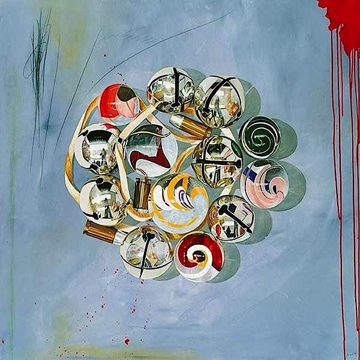

[The Rymer Gallery](http://www.therymergallery.com/gallery/?id=58) in Nashville  
Aaron Payne Fine Art in Santa Fe  
[June Kelly Gallery](http://www.junekellygallery.com/dayton/) in Soho, New York

## parallel universes converge 
### in a triple gallery mid-career retrospective
Looking back over the works selected for Joyce Melander-Dayton’s mid-career retrospective, three stages can be articulated. The artist moved from objectivist juxtapositions to a non-objectivist affair with pure shapes and organic textures. The work representing twenty-five years has completely metamorphosed--and revealed key conceits in doing so. 

*The Little Things*

Always interested in patterns and pairings, Melander-Dayton developed a highly polished technique of rendering shoes, bowls, bells and other tokens. A 1993 acrylic and pencil work *Dead Dog* depicts a row of tightly drawn Monopoly charms—a thimble, a hat, a wheelbarrow and so on. The cast figures line up in a row on a white bar superimposed over a rich, washy brown atmosphere. The word GO in red appears austerely below them. 

> *The visual phenomena of the objective world are, in themselves meaningless; the significant thing is feeling.*  Kasimir Malevich

Fine-tuning the balance between realism and abstraction, Melander-Dayton painted a thin white X across the entire canvas, from corner to corner. This earlier composition, with its symmetric mix of charged imagery and neutral content, presages the artist’s evolving concerns. 

*Cumberland Blues*, from 2002, synthesizes the realist / abstract divide into an iconic impression of fluidity. A swaying blue line runs down the left side of a canvas, suggesting the Cumberland River. A vertical black line separates it from a column of circular shapes and outlines. These roundish shapes are like bubbles or the heads of a crowd. 

Some of the oval shapes are painted and some are woven onto the linen surface with wool. White faces, black balloons, and half-painted blue eggs in different sizes--all rise from a scored, scarred scrum of overlapping under painting. 

In a dialogue between the two sides, time appears endless on the left and instant on the right. The serenity of the broad blue band undulating down through space is countered by an insistent, jostling ascension. The river’s mighty scope is reframed as the sum of its component drops. Melander-Dayton’s play between forms leads to ultimate syntactic shifts where abstraction becomes metaphoric.

Pulling from her childhood experiences in Asia, the more recent work extended an artisanal approach. Elements of folk art, craftwork and _feminine_ arts (like embroidery) have been amplified, upsetting notions of hierarchy.

*Rondo* from 2009, breaks free from a framed presentation. A slew of curved triangular shapes (39 in all) were arranged on the wall, bridging a corner at the Rymer Gallery exhibition. The notion of fluidity animated the modular array. 

Like stones in a stream, the units were related by their smooth contours and marine hues. Varying in size, the labor-intensive pieces included wool, cotton and beads on gator board. Built-up edges were elaborately woven. Looping lines of thread ran across the sea-blue surfaces. Interlocking shapes rose and submerged.

Melander-Dayton’s triangular forms suggest palettes, sewing hoops or guitar picks. In her latest work at Aaron Payne Gallery, she has focused on this distinctive form. *Archipelago* extends the concept of ??Rondo??. Like islands, eight shapes sprawl across the wall. Their sangria bubinga burl veneer recalls souvenir art painted on wood. The surfaces include silk, wool and beadwork patterns that evoke an Aboriginal aesthetic, echoed in the boomerang configurations.

In the last few years, Melander-Dayton has mastered a stand-alone sculptural strategy and *Canyonlands* leaves the wall altogether. This new work with its cinnamon, teak and salsawood coloring, reflects the Santa Fe terrain of the artist’s home.

In what could be an expression of geology, one triangle shape is mounted sidewise atop another. Onto the polished wooden surfaces of these two units, mimetic triangle shapes and outlines are overlaid. While resolutely enigmatic, they can suggest stylized hills or clouds or even as a mouth and eyes. However, the potential transfer from landscape to figurativism remains suspended in illusionary abstraction. 

Over the years Melander-Dayton has diligently distilled a personal lexicon based on iteration and gesture. The new plateau she has reached is grounded in the postmodern practice of attention to process. Her dynamic balancing act could be described as isometric, from the Greek term for _having equal measurement_. 

As an artist, Melander-Dayton finds lilting congruence between objective and non-objective--between abstract and representational. Her highly individualistic phrasing is poised and compact. The universal and the personal are fused in her lyric, liberating vision.
