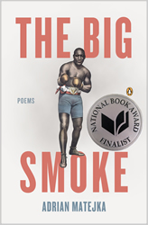

Although boxing holds no interest for me, I have always been intrigued by Jack Johnson, the first African American to be heavyweight champion. Adrian Matejka’s poetic paean to Johnson presents a portrait that beautifully captures the bravado, sexual energy and sophistication of an athlete whose 1915 victory sparked race riots. 

<figure>
  
  

*The Big Smoke*     
[Penguin Poets](http://www.penguin.com/book/the-big-smoke-by-adrian-matejka/9780143123729)

</figure>

Divided into five sections, there is a loose chronology mirroring Johnson’s humble beginnings of a child of ex slaves. "Battle Royal," the opening poem depicts a time when, "the man said only/ the last darky on his feet gets a meal", and slave-owners decided boxing slaves to be more exciting then chained bears being savaged by dogs.

>Papa’s head shines like a wheel  
with no tread. Beautiful man,  
mi amore. He shines like Lake   
Michigan in the July heat.

I loved Matejka’s emphasis upon Johnson's turbulent romantic life. There's an inclusion of excerpts from the Department of Justice's 1913 interview with one of Johnson's white girlfriends, Belle Schreiber. "He was so large he almost blocked all the light from the hall." As revolutionary and infuriating as Johnson's athletic triumphs were to racist America, his living large lifestyle of bling, luxurious cars and Caucasian consorts led to a false conviction under the Mann Act, causing Johnson to be a fugitive for seven years.

Johnson's marriage to Etta Duryea, a society girl, ended with her suicide. "La Trovatore" memorializes Etta, ending with the lines, "Like realizing/ Etta's still breathing, whispering/ a libretto on the heels of her last breath:/ You did this, Papa. You did this."

Interspersing equally fascinating narrative voices, Johnson emerges as an American hero, volatile, flawed and a fabulist who wrote three autobiographies. "Ticket on the Titanic" explores Johnson and Etta's attempts to buy tickets on the segregated luxury liner. "Of course, the color line kept me/ from fighting for Etta's space on a lifeboat/ when the iceberg hit." The concluding line resounds compassionately, "I would never dance the Eagle Rock/after all those people drowned."

*The Big Smoke* is a poetry book for readers who might not read poetry. Like a great novel, the plot and characters are equally compelling. History transmutes to a lyrical legend, and Jack Johnson once again triumphs in *The Big Smoke*.
