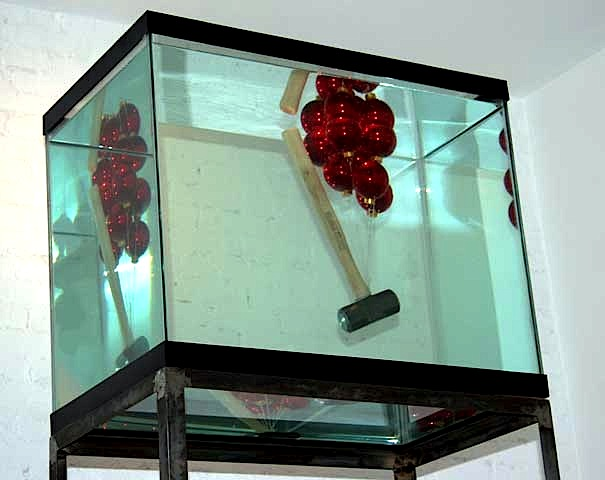

The Fan and the Shit   
[Magnan Metz](http://www.magnanmetz.com/exhibitions/alejandro-almanza-pereda-the-fan-and-the-shit)

Like accidents waiting to happen, Alejandro Almanza Pereda’s work challenges structural integrity as it engages the concepts of stability, risk and danger. In a second show at Magnan Emrich Contemporary, the artist has fine-tuned his iconoclastic, sculptural assemblages. Moving away from found objects and furniture, he builds on groundbreaking shifts in materials first expressed in Jeff Koons’ fish tank and Haim Steinbach’s commercial items displayed on shelves. Pereda’s new show extends his earlier balancing acts while rounding off some rough edges.  

Lighting fixtures are still part of Pereda’s trademark vocabulary as are construction tools. As previously, objects are re-contextualized in startling combinations and height is examined, as works are precariously elevated and placed “out of reach.” 

In “It is for our own safety”, the cachet and elitism of red velvet ropes are telescoped and spoofed at the same time. By making the metal poles 10 feet high, Pereda amplifies the materiality while rarifying the vision. Above us, the seductive ropes sequester a sparkling chandelier. The silver, red and crystal are imminently appealing, evoking class and exclusivity and exuding a faux fairy tale aura. Yet a visceral feeling of smallness, rejection and insecurity falls on the viewer as he or she walks between the poles and under the chandelier. 

Much of Pereda’s muscle comes from his ability to symbolically charge the atmosphere and mirror emotional states. Nowhere is this more apparent than in the central work of this two-part exhibit. Based on the game of Rocks, Scissors and Paper, items are ensconced in a glass grid. Shiny metal clips hold the transparent squares and rectangles together. Evoking domesticity, industry, panic, violence, life and stagnation, the different things inside create a schismatic dialogue. 

Some of the objects are repeated. Six paper globes glow, each lying on its side with wires running up and into the ceiling. There are five axes emblazoned with the logo TRUPER. A cone of confetti… some lumps of coal… two bonsai trees… five cinder blocks… nail clippers… a law book… a discourse is opened between these disparate entities.

In a top compartment a glop of cement has smeared the sides and hardened in the center. Characteristically, Pereda has inversed the balance and put the heaviest part on top of a seemingly fragile construct. In one of the bottom cubes, an open tall boy in a brown paper bag completely deflates the elevating concept of a vitrine. Usually, vitrines house esteemed relics not empty beer cans. 

Witty and irreverent, the piece is also aesthetically intriguing with its rhythms and reflections. At the heart of it all is a wad of fifty-dollar bills. An axe in glass communicates emergency as well as temptation. This is not a passive display in the sense that it both mirrors anxiety and impulse.

Weight is conflated with light in a giant ball of chains hanging in the Magnan Projects space. Pseudo-chandeliers in art (pioneered by Petah Coyne) possess incumbent magnetism but this one also carries a disturbing mass. *Out to Lunch/Closed for the Day* calls into question our reliance on safety codes and official inspections. The shiny metal coil (approximately a ton’s worth) approaches the structural limit of the chain’s strength to hold itself up. Pereda’s recurring strategy is to take things right up to the breaking point.

Courtesy of Magnan Emrich

In another incredulous piece, atop a slender welded frame about ten feet high, perches a forty-gallon fish tank. In the water a host of red Christmas balls are tethered to a mallet, suspending it. The wooden handle floats up but the heavy head pulls down. In this sculpture, Pereda’s intense vision has moved literally from support to suspense.

A holiday buoyancy is countered and re-channeled. Opposing equations co-exist. Sinking, flooding, and breaking are held in check but exert an ever-present pressure. Action is implied--specifically the possibility of the mallet smashing the bright ornaments or the glass tank. The contrast is paralleled by the opposing elements of air and water.

In a pair of serigraphs, Pereda echoes this balanced opposition. He depicts eggs in cartons, first on top of a scale and then underneath it. By placing the scale on top of the eggs, hope is threatened but reinforced. In Pereda’s art, we gasp as the normal order is reconvened in unexpected signals of renewal. The ephemeral parts of life hold up the concrete. The light holds up the dark and the heavy.

Remarking on his playful title, “The Fan and the Shit,” Pereda quipped that it was about the fans of art coming to admire his new shit. Art can be considered as the byproduct of mental digestion. This show presented some potent cerebral fertilizer.