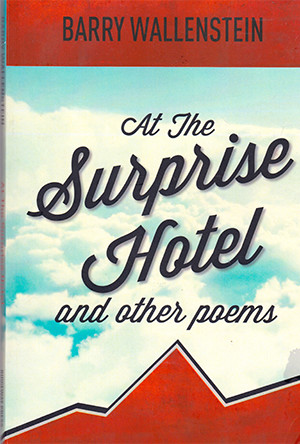

---  
title: At the Surprise Hotel
author: Karen Corinne Herceg
date: 2017-12-01
template: article.jade
absurl: https://reviews.livemag.org/articles/at-the-surprise-hotel/
---
Barry Wallenstein’s latest collection of verse continues his pioneering foray into blending jazz and poetry. The poems are infused with a distinct musicality that’s reminiscent of raw bars and bayou blues. Stripped down emotions are buoyed by irrefutable truths. 

  
<figure>
  
  <figcaption>
*At the Surprise Hotel and other poems*   
by Barry Wallenstein    
[Ridgeway Press](https://www.spdbooks.org/Products/9781564391414/at-the-surprise-hotel-and-other-poems.aspx)
  </figcaption>
</figure>

Wallenstein’s *oeuvre* is truly performance poetry, incorporating the angst and cadences of jazz into bittersweet riffs that acknowledge our human foibles. Now, as a mature auteur, his work remains unjaded and authentic while tackling some stark realities. Instead of churning pity or bitterness, he recycles his reflections into insights.

There are four sections in the book, each with a distinct theme. <em>At the Surprise Hotel</em>, (the title of the book as well as the first part), takes on a universal view of multiple characters, allowing us to see how our transitory, illusory perceptions and expectations often deceive us. The characterizations offer visual as well as auditory stimulation such as “she wears faux rhinestone tears” and “with lashes like the fins of fancy fish. In many ways these people are representative of certain types familiar to all of us as the writer elevates them into archetypes.

In the second part, _Events_, short vignettes employ realism, surrealism and forthright honesty, to each us something new in each piece. Anyone trying to go beyond writing that is other than mere description or exposition will appreciate the difficulty of this accomplishment, particularly on such a consistent level.

In “The Sommelier Says” we find what continues on in the world is often just a semblance of gentility: “The diners sip and smile again/ having put to sleep the threat of riots.” And a woman named Mina “is a marvel/ seeing into the hearts of people,” yet a frown is her natural expression. Emotions that are more intellectualized than felt, distance us from empathy. Distraction becomes a safer default position: “…you’d love the story but be too occupied to respond.”

Wallenstein warns us about our inability to be aware of ourselves, to look deeper, as in “Unprepared.” He reminds us that beyond our perceived stability “shadows drift and break/against the jagged stones.” And in “Murder in the Ranks,” we find many misdirected purposes masquerading as revolutionary  solidarity, the impetus being more about individual grievances than a common cause. There are many faux promises and pretentions to action, all a camouflage for loneliness and fears.

“Poetry Writer” and “Poetry Reader” respond to one another from two perspectives that are metaphorical for how we truly give and receive. In further companion pieces, Wallenstein shows us that poetry can subtly invade our senses, leaving lingering fragments like the refrain of a song.

Part three, _Encounters_, immerses us in the vagaries of romance. Wallenstein does this through observation rather than judgment. In “The Dispirited Lover” the telling lines “sweetened not by memory/ but by what memory denies” remind us to be wary of sinking into the comforts of melancholy.

The last section is aptly entitled _Departures_ in which Wallenstein examines mortality. He reminds us that we need to be vigilant about our presumptions. In “Tomorrow” he cautions, “Banish the thought that blocks the rhythm/ advancing age supports the pretense of wisdom.” As we nourish our solitude, particularly as we grow older, there is danger in that isolation: “Then they spoke about madness/  and how it thrives in exile.” We must not allow our *doing* to obstruct our *being*.

In the touching elegiac poem “Taking Names: for Stephen Watson,” there are lovely ruminations on bereavement: “…this must have been an error/ to cross off my handsome friend/ in the middle of his everything.” In cataloging losses Wallenstein employs concise imagery that highlights the many ways we deal with death and the unavoidable: “—the train’s late; stormy weather on the platform/ standing on the tracks is a windy apparition.” 

In the final poem of the book, “What Was, Was,” the last lines offer sage advice to live in the moment: “For every was in time’s fast memory/ an *is* trumps the was every time.”
