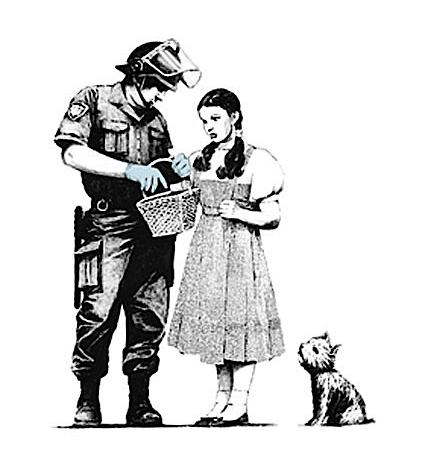

Bankrobber Gallery, London  
Vanina Holasek Gallery in Chelsea NYC

Every weekend there’s been a line outside one of the last quaint buildings left in the gallery district. The notoriously secretive Banksy is showing on all three floors of the Vanina Holasek Gallery. The windows are covered in American flags and Union Jacks with Victor rattraps attached. Other street artists, Pons and Elbow Toe have put up posters on the building and next door. A doorman with a clipped Brit accent, wearing a knee-length leather coat with a skull molded into it, allows you in. 

Crime tape and paintings left half-visible through bubble wrap immediately connotes an exhilirating sense of displacement. This ain’t your momma’s gallery.

Banksy is an art legend. Sometimes called a guerrilla artist, he’s renowned for his hard-hitting political street art and museum escapades (he’s sneaked his own paintings into several museums). Yet he remains _muy_ elusive and reportedly no pictures of him have ever been released. Rumor had it that he was on the third floor at Vanina Holasek Gallery’s opening. Or he may have been in Bethlehem at another of his openings. He had been there to paint on and “through” the wall dividing Palestine and Israel.Banksy’s website said the New York show was unauthorized and “probably not worth seeing.” The Bethlehem show was authorized and also “probably not worth seeing.” Very funny. 

Banksy slams icons together in a typically deconstructivist manner. A happy face peeks out from the grim reaper’s drooping hood. Soldiers keep guard while painting a peace sign on a wall. A masked urban guerilla pulls back his arm to hurl… a bouquet. The obvious appeal of clichés are challenged and forged anew.

Courtesy Vanina Holasek

A jaguar busts out of its barcode cage and heads threateningly our way. This image is a metaphor for Banksy’s whole career in a way. It is the triumph of the wild spirit over the hegemony of civilization’s repression that makes Banksy a real hero.

He cruds up the Queens the way Andres Serrano re-crucified Christ. Anachronisms and startling juxtapositions confront cultural disengagement. Hunters with spears stalk grocery shopping carts. Stripped down to the barest elements and presented in the starkest tones, the visual impact is huge. The aura and edge of street stencils give the works an aggressive and self-assured allure.

The humor is more tongue in cheek than vicious: “Abandon Hope 9am to 5am.” Regardless, the point is made and hypocrites are targets. Banksy spares neither the power elites nor the die-hard radicals. A line of ragtag punks gathers to buy tee-shirts that proclaim “DESTROY CAPITALISM.” Actually, much of Banksy’s appeal is his punk aesthetic, polished as it is. There’s something irresistible about a chimp queen that screams Sex Pistols and shivers with defiant, raw energy.

Banksy is a lot like Delacroix’s Liberte&acute; storming the barricade &mdash; it’s hard not to get behind him.

_This article first appeared in Chelsea Now_