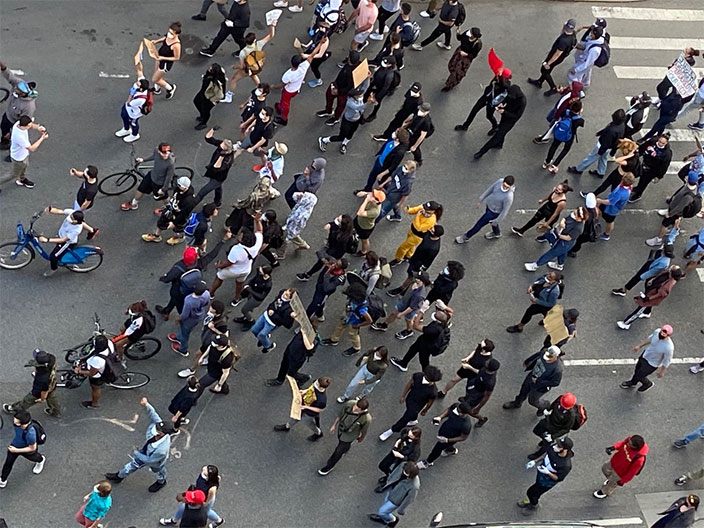

This nation has to reshape its moral imagination so that the impunity of the police and the corruption of politicians can be diminished, stopped, and reversed. We stand for the voices of art, of culture, all cultures, being allowed to speak freely. The political sphere always affects the cultural, sometimes vice versa, and in this particular moment of heightened police brutality and inept responses to the exercise of the right to peaceful assembly, we find it vital to stage an active response. We want police to stop murdering unarmed black and brown people throughout America. We want police officers held accountable for their actions. Enslavement and the legacy of the unfulfilled citizenship of African Americans continue to poison American society and jeopardize and circumscribe the lives of Black citizens, no matter their economic status. Now is the time to seek a real transformation of American society, its political discourse, electoral politics, policing, the judiciary, public education and labor. We want an end to the extremes of income inequality. We share the outrage of many other citizens and organizations particularly #BlackLivesMatter, and we share the hope that this outrage will propel us toward changes in which all Americans can share.

 Photo: LiVE Mag! 7th Ave., NYC, 5/31/20

_The American Poets Congress is a cultural organization started by poets but including cultural workers in all of the arts. We engage in projects of awareness, advocacy, and action that support the value of inclusion and that assert, reclaim, and maintain racial, social, and economic justice for all Americans across borders of race, ethnicity, national origin, class, gender, sexuality, religion, ability, and other markers of identity and difference._
