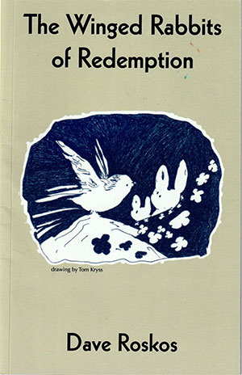

Magic is wrung from the dust in Dave Roskos' razz-flown, beat  up, cracked hallalujah Skeltonics. 

<figure>
  
  <figcaption>
*The Winged Rabbits of Redemption*   
by Dave Roskos    
[Cat in the Sun Books](https://www.amazon.com/Winged-Rabbits-Redemption-Dave-Roskos/dp/B09FS9NDYP/)
  </figcaption>
</figure>

In stripped down epistles of lyric loss and love, these poems nail down some shadow pain and outlaw glory. Searing portraits of the strugglers. Out of luck junkies, spacey inmates, and hapless hustlers. Mystic connections to a way-troubled dad. Dave is a resident Saint of the Underground. He puts patches on the soul.