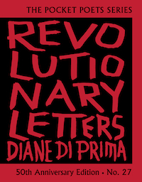
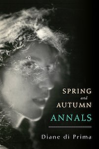

#### Diane DiPrima: Two Tributes

My first Diane di Prima book was *This Kind of Bird Flies Backwards*. I came across it in a Fourth Avenue bookshop as a fifteen-year old sophomore who had only read Charles Baudelaire and Emily Dickinson along with staid school assignments. Di Prima’s sexy, young and passionate poems were an immediate inspiration. By the time I read *Revolutionary Letters* in 1971, I was writing poetry and part of a women’s writing and consciousness group. Reading di Prima changed my life.

<figure>
  
  <figcaption>
*Revolutionary Letters* 50th Anniversary Edition  
by Diane DiPrima  
[City Lights Books](https://citylights.com/beat-literature-poetry-history/)</figcaption>
</figure>

But*Revolutionary Letters* was much more then a poetry book, it was a call to arms, a primer on how to live and embrace the counter culture. “It Takes Courage to Say no” ("Revolutionary Letter #155") admonished the reader to say, “no to canned corn and instant mashed potatoes.” Di Prima fashioned a siren song from a prescient approach to food rooted in health. Further macrobiotically-tinged survival lists are given along with reminders to save water in case of riots and “hoard matches, we aren’t good at rubbing sticks together anymore.” In “Revolutionary Letter #4,” the poet declares, “Left to themselves people grow their hair.”

Printed to commemorate the fiftieth anniversary of the original *Revolutionary Letters*, this expanded collection is as potent and precious as the first missives Di Prima penned.

>She addresses climate change, racism, motherhood, sex, life and death with the articulate fervor that makes her one of the most significant voices of her generation.

This current superb volume was edited by di Prima and includes more then four decades of *Revolutionary Letters*. She addresses climate change, racism, motherhood, sex, life and death with the articulate fervor that makes her one of the most significant voices of her generation.

<figure>
  
  <figcaption>
*Spring and Autumn Annals: A Celebration of the Seasons for Freddie*   
by Diane DiPrima    
[City Lights Books](https://citylights.com/beat-literature-poetry-history/spring-autumn-annals/)
  </figcaption>
</figure>

And for further inspiration, kudos to City Lights for also publishing *Spring and Autumn Annals*, which showcases di Prima’s daily writing practice as she mourned the suicide of her great friend, Fred Herko. A dancer and choreographer, his dramatic jeté from a downtown apartment ended his young life. These writings, penned to Herko, chart di Prima’s grieving process and eventual healing, as she navigated a bohemian life as a young mother and poet in the center of downtown Manhattan.

Reflective, provocative, and gossipy, di Prima navigated love affairs, published books and magazines and founded a Poet’s Theater. Inclusion of archival photographs are a special addition with candid shots of a young and gorgeous di Prima, John Weiners, LeRoi Jones, and Herko. Diane di Prima embodies bohemian bravery and first hand feminism. She remains a searing touchstone for visionary American poetry.

