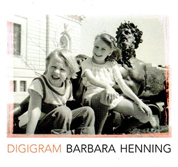

DIG! These seemingly simple reflections, observations, thoughts, and memories are woven together in a way that creates surprises and epiphanies. 

<figure>
  
  <figcaption>
*Digigram*   
by Barbara Henning    
[United Artists Books](https://www.spdbooks.org/Products/9780935992502/digigram.aspx)
  </figcaption>
</figure>

Barbara Henning has been developing her unique style of prose poems for her whole career, in a voice that is convincing, clear, and consummate. She touches all the touchstones from politics to age, ancestry, and sex. "you stuck your tongue in my mouth."

This poet's tongue will get stuck in your brain. Welcome Digigram, from the late Lewis Warsh's United Artists Books, (whose similar diaristic notebook style is equally seamless and consuming). Like strings of haiku, like beads of light.