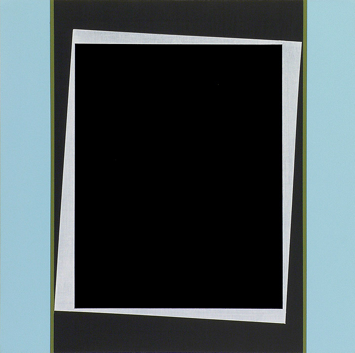
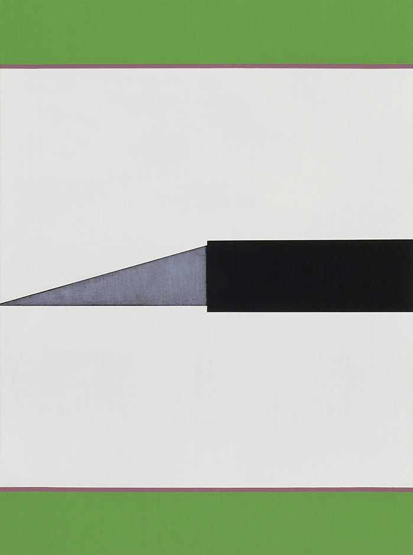

__Don Voisine__  
[McKenzie Fine Art](http://www.mckenziefineart.com/exhib/don-voisine-2021-exhb.html)

The impressive show of Don Voisine’s latest elegant paintings on panels are human scale — sized for modest living spaces — but magnanimous in stature. All were completed in the last few years when Voisine was coincidently granted a studio space at the Marie Walsh Sharpe Foundation.

There he found the focus to bring his abstract paintings to a deeper level, in more ways than one. As always, he breaks open the picture plane by varying surface treatments: reflective gloss vs light-absorbing matte. But he also shakes up the composition of flat forms optically, within the confines of the panel they smoothly (even smugly) sit on — to give us more.

*Hidden Room* functions as a few layered dark rectangles that sandwich a light-gray, tilted one. The smaller, top layer leaves stark trapezoidal light-gray borders that appear to turn the whole back and forth in space, dislodging the elements as if they can pivot on a central, horizontal axis.

*Hidden Room*, 2021, Oil and acrylic on wood panel, 12 x 12 inches

His refined play with color theory is the most evident in thin, barely-there strips of color separating rectangular bars and spaces that help to achieve the paintings’ animated surfaces.

Juxtaposing chromatically similar colors — two adjacent close shades of red, two close blues — he makes planes that work with each other to move the forms beyond the frame, implying depth and belying the flat presentation. Teasing us into and out of it in a metaphysical sense.

But the compositions are grounded in reality. His wedge elements lead the eye around or out of the picture. The shapes craftily recall objects in the studio. For example, bars and corners in several of the works suggest the painter’s stretcher or the panel’s cradle (Voisine paints on wood panels). 

*Exact* reiterates Voisine’s exacting application of paint. And its steel gray triangular shape suggests an Xacto knife blade. Recognizing it, I laughed out loud. This audacious pun, double entendre, bit of comic relief — pokes fun at the severity of these meticulous paintings. Not a stray mark or brushstroke is in evidence.

*Exact*, 2021, Oil on wood panel, 16 x 12 inches

They appear effortless. The clean color boundaries don’t call attention to themselves, except where he’s allowed a gray polygon to pool a tiny bit for emphatically sharp edges. In these areas where he's applied the paint with *frottage*, * he depicts the materiality  of metal, uniform pencil shade, and even the texture of linen. Commanding equal presence with the other color areas these gray sections appear to have some shallow fluidity and ethereality. This is a subtle and welcome shocker: a hole in his general allegiance to opacity.

The graphite areas create ‘planes’ (if one wants to separate out the reflective black, primaries and tertiaries). Then there are very light gray expanses; silky smooth and inert. The ‘colors’ sing around them. In *Cutter* a lightest-gray wedge butts up against an even lighter one. The rules keep changing and the combinations are limitless.

I can’t help but think of the digital screen that is so preponderant for most viewers (and possibly for Voisine). His additive, clipped, folded and unfolded squares can be compared to the pixels that form the basis of our digital views. His select colors mimic the screen’s finite palette and the optically animated shapes hint at the most modern digital experiences.

Voisine has spent decades refining a personal language with striking compositions of colors and geometry that are more than the sum of their parts. He’s stretched his trademark economical palette and playbook in this new work. At the top of his game here, he keeps us attentive to his radar. It is trained on the outer limits of his brand of lush minimalism.  

**frottage* is a rubbing and scraping method associated with Max Ernst and the Surrealists.