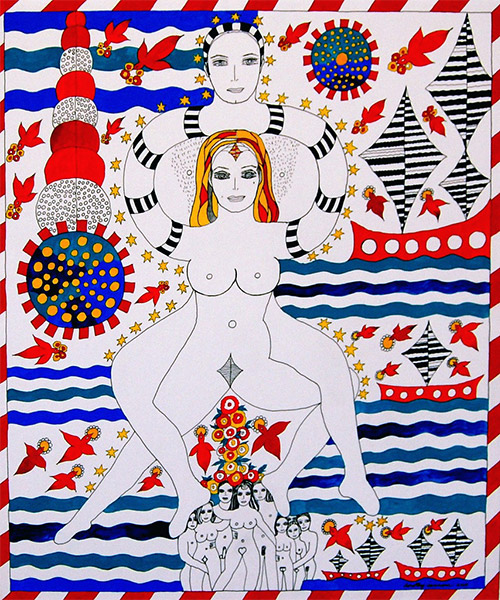

## see her roar

"I had an overwhelming reason to change my life completely, being in love was the first and only thing," Dorothy Iannone told me on the phone from her Berlin home. Four decades ago, this grand passion propelled the self-taught American artist Dorothy Iannone (b. 1933) to create an expatriate life with her lover, the influential Swiss-German avant-garde artist Dieter Roth (1930-1998). Documenting their love affair, Dorothy took Dieter as her inspiration and muse. "The two of us became the stars of my work," Iannone said. Her highly personal and poetic artwork was the subject of concurrent shows at the New Museum and Anton Kern Gallery in Chelsea this year. 

Since the early 1960s, the Boston-born Iannone has made intensely intimate and original paintings, drawings, figures and mixed media pieces. New Museum curator Jarrett Gregory, inspired by seeing Dorothy’s work in the 2006 Whitney Biennial, put together a beautiful, if small, show of Iannone’s work from the ’60s and ‘70s, including her iconic 1976 book *The Icelandic Saga*. "Dorothy is a liberated human being and makes work from her heart, which gives her practice an immediacy that is uncommon and refreshing," Gregory said.

> Honoring the past and embracing the future she was filled with love for everyone. --Icelandic Saga

Included in the New Museum show are Ianonne’s early "People Series," painted wooden figurines depicting Charlie Chaplin, a pugilistic Norman Mailer, bare-breasted geishas and Jackie Kennedy. Genitals hang casually from trousers, erections exaggerated. These early figurines embody Iannone’s lifelong celebration of sexuality as integral to life. For "Access All Areas," an upcoming group show at Galerie Max Hetzler in Berlin, Iannone is again devising cut-out figures. "Somehow I got the wish to make more cut-outs, with the text integrated, maybe at the bottom," Iannone said. "The scenes are mostly from films I have seen over the years."

Iannone’s large paintings depict her and Roth in formally sensual unions, inspired by great romances, such as Shakespeare’s Anthony and Cleopatra. Female and male are portrayed as equal adventurers. A reduced and powerful palette highlights tribal details, while referencing an early Pop sensibility.

The African motif appears as a trio of ebony and gold shields in *I Begin To Feel Free* (1970), and again via balanced tribal decorations in *I Am Whoever You Want Me To Be* (1970). Both couples depict a pelted Roth balanced by Dorothy’s armless Pop figure. Her colors and free mix of image and text remain as international as they are contemporary. 

At the Anton Kern Gallery are nine more works, including paintings made from earlier sketches. Later pieces like *On the Continuing Journey*, with its erotic mandala, are suffused with Buddhist equanimity and reflect a spiritual synchronicity. Her imagery, consistent in detail and line, has grown more refined in her present work. Breasts which ended in bulls-eye nipples now feature decorative corollas. Opulently adorned surfaces are reflective of an expanded consciousness.

Male and female equality remains constant. Two works from 2009 embody a psychedelic energy. *Tickles My Fancy*, a gouache-and-ink on board, features extravagant adornment illustrative of an expanded consciousness, as does *Metaphor*, with its silken bondage cord and tattooed text, reading "sometimes you must also submit." Instead of the usual autobiographical raven tresses, this odalisque is blonde and buxom.

Dorothy’s gentle, hypnotic voice echoes through the gallery, the sound of the audio CD included in the 1972 piece *Dinner Box*. The painted box is crowded with a haunting cast of revelers. Iannone, who has been censored and under-appreciated in her native America, is enjoying a renewed interest and enthusiastic appreciation of her profoundly personal vision.

New Museum curator Massimiliano Gioni calls her "our great lady of irreverence." Dorothy studied literature, but says that "I just wanted to make art. I just kept doing it. I was doing what I wanted to do."

_A version of this article first appeared in artnet._
