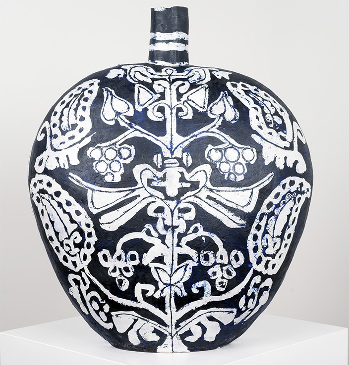

The famous sonnet *Ozymandias* by Percy Bysshe Shelley, reflects on a monumental sculpture’s eventual ruin and collapse. Elisabeth Kley’s exhibition appropriated the title to likewise challenge time, while exploring such diverse concepts as individuality, transience and tradition.

Venetian opulence permeated the evocative installation of ceramic vessels, works on paper and two sweeping floor-to-ceiling panels. Classic motifs mined from Chinese calligraphy, Japanese design and Islamic ornamentation are reconfigured with fresh vision and relevance.

Byzantine decorative patterns, Matisse’s textile depictions, and the bold style of Vienna’s Weiner Werkstaäte also come to mind. A decidedly urbane aesthetic unites the diverse mediums and epochs.

Ten ceramic works, which the artist identified as "flasks," are made using the labor-intensive hand rolled coil-and-scrape technique. Kley, originally a painter and now also a ceramicist, has stated, “I’m not athletic enough to throw &hellip; and it would have been too messy to work with water and wheel.”

*Large Black and White Flask with Tree* (2015) is a bulbous shape covered with winningly rough symmetry and repetitive  undulating images. Truly objects of poetic emotion, sgraffito (scratchings) reveal a sumptuous underlayer of blue. Kley’s virtuoso mark-making generates a seductive energy.

The relief prints on Japanese paper depict stylized vases and urns, echoing Aubrey Beardsley’s pictorial tradition. Two sweeping, tessellated panels anchored the entire room, transforming the gallery into a dramatic installation &mdash; part magic lantern, part tribal totem.

Kley is also known for her witty black and white portraits of artists, drag queens and writers. That same linear elegance appeared in this show’s bravado brushstrokes and interlaced forms. Within the parameters of a subtle and elementary palette, Kley’s painterly imagery is both sinuously delicate and powerfully direct.

The results are gorgeous, quirky creations that suggest that they are meant to hold something valuable and exotic. And they do &mdash; they hold our attention, steadfastly. 

