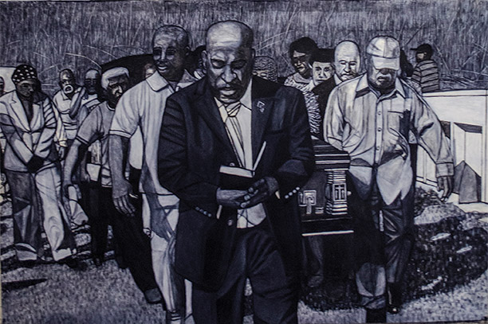

Twentytwenty. Sounded like it should’ve been perfect. Instead it’s been a year for lemonade as we’ve struggled with the pandemic. As I write this it is December first, designated as a Day without Art, a day to honor victims of another pandemic, AIDS. Thanks **VISUAL AIDS** and all who work for others, especially our medical care givers.

It’s good to have a purpose. It was a thrill to do daily FT puppet shows for my granddaughter in Chicago. [Check *Pandemic Puppet Jam* on Youtube](https://www.youtube.com/watch?v=y2p125jYTcw) for some chuckles.

Virtual encounters are a lifeline. Thanks to **Jane Friedman** and *Howl! Happening* for continuing to find ways to share art. Jane was our first *Live Mag!* Lifetime Achievement Award winner.

Poet and publisher **Robert Hershon** accepted our second annual award at Howl! a year ago. Robert just brought out issue 111 of *Hanging Loose Magazine* (my "Madhattan Classic" included). 
We continue with two awards — one to artist **Willie Birch**. Willie and I met when we were both working in the Comprehensive Employment Training Act (CETA). I’ve never known a more engaging artist.

Willie Birch, *Country Funeral (Funeral for JD)*, detail of diptych, 72 x 96 in.

We also honor writer and actor **Michael Lally**, the King of Play. Beginning in ’72 with *South Orange Sonnets*, he now has over 30 books, including his most recent overview from *Seven Stories*.

*Local Knowledge* magazine fiction and poetry series continues on Zoom. Publisher **Sanjay Agnihotri** and I have been co-hosting readings for five years. 2020 included **Keisha-Gaye Anderson, Andrei Codrescu, David Mills, Steve Luttrell, Alan Kaufman, Sara Sarai, Bernard Meisler, Ed Sanders**, and **Luc Sante**.Bon mottist **Greg Masters** put out *Collaborations*, a redux of much of the **St. Mark’s** 3rd gen NY School. Work by **Allen Ginsberg, Ted Berrigan, Jim Brodey, John Godfrey, Elinor Nauen, Bob Holman**, and **Nellie Vargas**; The *Disciples of Distress*, a play by Greg and me; historic photos by **Monica Clarie Antoine**, contributor **Tom Weigel**’s sister.

Thanks galleries that encourage poetry. *Lichtundfire* Director **Priska Juschka** is tireless. She’s invited **Jonathan Goodman, Barry Wallenstein, Allan Coleman, Barbara Rosenthal** and more. A **Jack Youngerman** (1926-2020) painting hung the night of our book launch (Party Everywhere). And *Zürcher* with **John Yau** and **Tom Devaney**.

Thanks good people at *Lit Balm* — the weekly reading series that started to keep us connected, **Jonathan Penton, Larissa Shmailo**, and **Marc Vincenz**.

Great news! Issue #18’s art will be curated by **Madeline Weinrib**! Madeline and I worked together on *Cover Magazine* and she sponsored events for us at *Art In General*. Thanks Deputy Editor **Ilka Scobie** for helping set this up.

Finally, deep thanks to designer and Contributing Ed **Lori Ortiz**! Check our new online [store](https://store.livemag.org) where you can buy our back issues. Hurray to our contributors and community who have brought us through our 13th year. Best of luck to us all!