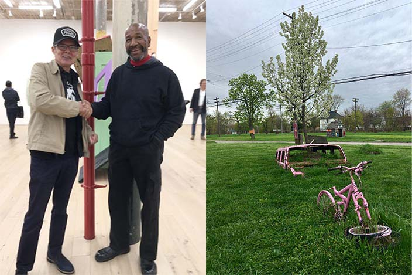

January 1, 2019. The year started off with **Bruce Weber** and **Joanne Pagano Weber**'s beautiful Alternative New Years Day poetry marathon—their last one in New York. We thank them for 25-years of devotion to community.

Then my friend **Carole Sorrel** hooked me up with **Albert Scaglione**, the founder of **Park West**, the largest gallery in the world according to *The New York Times*. He wanted me to do a writing project.

By February first I was on a yearlong whirlwind that would take me to Detroit, Atlanta, Orlando, Miami, Amsterdam, Belgium, and the Caribbean. I met several artists working with **Park West** — **Romero Britto, Lebo, Tim Yanke, Clare Sykes, Wyland**, and **Glenn Marcus**. The father of Kinetic art, **Yaacov Agam** did my portrait in Paris! And I renewed my acquaintance with **Leslie Lew** who I knew from the bad old EV days.

Albert was a lot of fun to follow, full of vim, vinegar, vitality, and veritas. I loved scribing his wit and wisdom and made many new friends.

The **Detroit Institute of Arts** gave a group of us a tour thanks to Albert’s sister **Diane Pandolfi**. **Ruben** and **Isabel Toledo**'s “Labor of Love” exhibit reimagined the museum with pieces they created that were inspired by the Institute’s collection and then placed in situ. I loved the surprise and incongruity — like strange doll figures in elaborate costumes sitting on a 300-year-old table.

Jeff and Tyree Guyton, Guyton public art, Detroit.

One morning the crew visited the **Heidelberg Project** by artist **Tyree Guyton**. The artworks sprawl across a once-vibrant section of Detroit in places where only a few homes are left. **The Spotted House** is the most recognizable landmark in the section that stretches for several blocks.
Back in New York, I got to meet the visionary artist at **Martos Gallery** for his opening. He’s continuing to build on his signature look, using a mix of fine art materials and recontextualized objects. “…Everything is connected to this one source of energy or this divine power.”

In the world of poetry and writing, the year brought several legends low. **Steve Cannon**, founder of *A Gathering of the Tribes*, opened his home and his heart to writers, artists, and musicians. He was feted by hundreds of friends and mourners in a second line parade that flounced and sashayed through the EV. “Love you madly.” [Live Mag # 9](https://livemag.org/pages/issue_9.htm#cannon)

**Steve Dalachinsky** turned off the light after reading for *A Book About Death* by **Ray Johnson**. Steve knew how to be a star. We send love to his partner of 40 years, **Yuko Otomo**. *Live Mag #2, 8,* [16](https://livemag.org/issue_16/steve-dalachinsky/)

And **John Giorno**, the great poly-artist who electrified audiences with his syle, slipped off while his show was up across the street at **Sperone Westwater**. Giorno Poetry Systems enlarged the audience for poetry. “You got to burn to shine.” [Live Mag #12](https://livemag.org/issue_12/giorno.html) All sympathies to his partner, **Ugo Rondinone**.

Count your blessings, faithful readers, and shine.