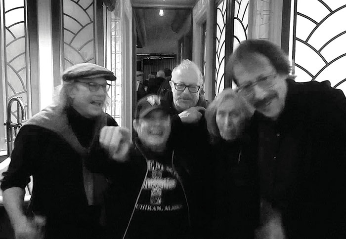

Dire urgency beseeches our attention at every turn, calling for focus and purpose. Let us go forth now in the service of deliverance.

Poets at KGB, l-r: Steve Lutrell, Jeff, 
Andrei Codrescu, Yuko Otomo, Ron Kolm.

#### keeping spirits bright department
For magnificent contributions to the arts, _Live Mag!_’s annual Lifetime Achievement Award goes to **Andrei Codrescu**. Encourager, energizer, endearingly “Exquisite.” Andrei has published more books than you can dream of! Previous winners include **Bob Hershon, Willie Birch, Michael Lally**, and **Jane Friedman**.

#### hotbed of activisionism
Director Jane Friedman and _Howl! Happening_ keep the lights on! The grand opening of a second space on the Bowery—Howl! Arts/ Howl Archives (HA/HA) conicided with an inagural show called “Icons, Iconolclasts and Outsiders” feauturing art by **Marguerite Van Cook, Brian De Palma, Scooter La Forge, Walter Stedding, Richard Hambleton**, photography by **Marcia Resnick** and **Gail Thacker**, and **Ramones** memorobilia designed by Howl’s inspiration, **Arturo Vega**. All the work was from Jane’s own collection and included several vitrines with seminal books by **Patti Smith, John Giorno, Richard Hell, Candy Darling, Allen Ginsberg** _et plus_.

#### the fun doctrine
As an artist-in-residence at Howl! I participated in their _& friends_ series, inviting friends to perform in “The Fun Doctrine.” Four episodes are available on _Howl TV_. Performance with **Helixx Armageddon**; poetry and prose, **John Reed, Jose Castañera**, (DJ Uptown GI Jose), **Mike DeCapite, Ama Birch**; film, **Rita Barros, Luigi Cazzaniga, Lili White**; music, **Roger Manning**; art by **Kathe Burkhart, Chris Lee**; and puppets!

#### double wham at la mama
_La Mama_ hosted two _Live Mag!_ events in 2021. It’s always a major kick to work with **William Electric Black**. “Bustout Nation” featured **Patricia Spears Jones, Jose Padua, CA Conrad, Penny Arcade**, and artist **Carl Hazlewood** of _June Kelly Gallery_.

We came zip-roaring back for the “Nice n’ Naughty” live show at the newly renovated theater on East Fourth. Special featured reader **David Henderson** was joined by a rollicking crew including **Adeena Karasick, Jerome Sala, Maria Damon, Sam Truitt**, with art by **Tamara Gonzales** and **Daniel Rosenbaum**. Thanks to the Poetry Electric Series. Working together for 15 years!

#### tompkins rompin'
_NY Public Library Tompkins Square Branch_ mounted “Indy Indeed: A Half Century of Downtown Indie Publishing” curated by **Greg Masters, Ilka Scobie, Ron Kolm** and myself. The overivew included publications and ephemera from small presses including **Annabel Lee**’s **Vehicle Editions** and **Bararba Rosenthal**’s **Xanadu Press** with books by **Barry Wallenstein** and **Bonny Finberg**. Also **Hard Press, The Operating System**, _Mag City, Cover Mag, Vanitas, clwn wr, Tribes_, and _Live Mag!_ Receptions with **Sheila Maldonado, Esther K Smith, Linda Kleinbub, Phillip Giambri, and Sharon Mesmer** accompanied the exhibit. Big thanks to librarian **Alyona Glushchenkova**.

#### shout out department
Yay **Rob Curcio**, curator of “The Rose Show” at _Mizuma and Kips Gallery_ which included artists **Gregrory de la Haba** and **Claire McConaughy**, for hosting _Live Mag!_ readers **James Feast, John Trause, Jan Castro, Gena Gruz**, and **Anton Yakovlev**.

Stepping out, **Arden Wohl** curated “Towering Minds”—the poetry series was a who’s who of cool — **Kyle Dacuyan, Sparrow, Amy Lawless, Eileen Myles, Anne Waldman, Bob Holman, Mary Reily, Ilka Scobie** and me and more at _Tibet House._

**Jim Ruggia** — Backroom Broadsides series. **Marc Vincenz and Jonathan Penton** with their Saturday zoom _Lit Balm_ series of readings.  _Local Knowledge Magazine_ and **Sanjay Agnihotri**. And big congrats to **Nicola Vassell** for opening a gallery on 10th Avenue and letting us share the work of **Uman!**

Finally, on our revamped "issues" page, scroll down to check out the new [artist and poet finder](https://livemag.org/issues) feature. Enjoy this year's [Edgy Issue!](https://livemag.org/issue_18/) And then visit our store to [subscribe!!](https://store.livemag.org)

