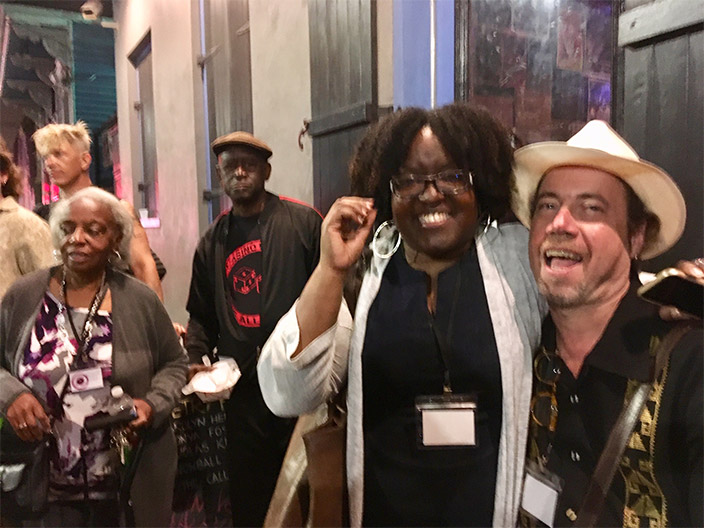

Entering our 11th year, the editors would like to thank our sponsors, **Howl Happening**, __La Mama__, and **KGB**. And subscribers and contributors. Thanks to our readers, audience, and party-mates. Welcome to our new Associate Editor, artist and curator **Kim Power**.

**New Orleans Poetry Fest**. What a gas! Live Mag! panel with *Poets Reading the News* editors **J Spagnolo** and **Elle Aviv**, plus **C&R** Press editor **John Goslee** shared publishing and publicizing tips—DIY style.

Came back to NYC with books from all over. Poetry of “brutal cartography” by **Hossannah Ascuncion** from *Magic Helicopter* (who also had *Noo Journal*). Oracle flarings from **Marc Vincenz**’s *Beautiful Rush*, **Unlikely Books**. Tables included **Lavender Ink/ Daialogos** with yummy translations of *Catullus* by **Joseph Bienvenu**, **Trembling Pillow**, **Western Kentucky U**, **Iron Boot**, **Chax**, **Convulsive Editions** from Chicago. Shoutouts to **Jonathan Penton**, **JS Makkos** and **Paris Tate**. 

In big-time New Orleans style, there was a splendid second line parade for the much-missed **Marthe Reed**, to whom the festival was dedicated. Saturday night at **Siberia Lounge** rocked—with **Douglas Kearny**, **Tonya M. Foster**, **Bruce Andrews**, **Jesse Statman**, and **Bill Lavender** topping it off.  Congrats to Festival founders Bill and **Megan Burns**. Round three: April, 2019. Featuring **Anne Waldman**!

Tonya M. Foster, her parents, and Mark Statman in New Orleans

**Allen Hansen**’s paintings: Super show of powerful, finessed rawness, paintings that project the grotto, the cave, the soul of expression! “Atmosphere of Nothingness / or O” at the ever-fun **Licthundfire Gallery**.

Painter **Amy Hill** makes the *NY Times* for her **Front Room** show of ironic, anachronistic portraits of idealized people in a disturbing utopia. Done to a tee.

>It’s one thing to live it. It’s another to remember it well. And it’s a whole ‘nother thing to write it down which **Martha King** has gloriously done.

*Outside/ Inside  just outside the art world's inside*, new from **BlazeVox**.
Romantic, uplifting, historic, sprawling, spunky and searching. So many cross currents of artistic lives, interactions with icons, told with clarity and catchiness. And insightful observations about class, gender, and ambition. What a valuable testimony! What scope. Martha brings it all home in this Romantic memoir /culture lab *tour de force* portrait by a pioneer in the front line. 

Touch down.

JCW
