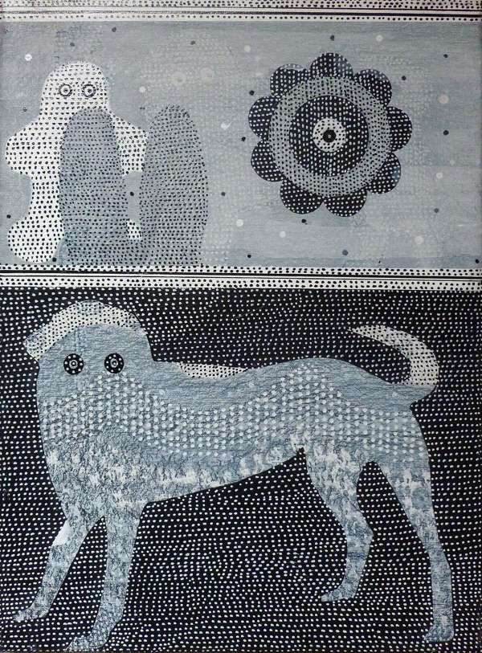

---  
title: "Glen Goldberg"
author: "Jeffrey Cyphers Wright"
date: 2013-08-18
template: article.jade
absurl: https://reviews.livemag.org/articles/glen-goldberg
---

Impulse and control stroll hand-in-hand in Glenn Goldberg’s gallery of icons. A dog stares back at you as you question it. A duck hangs in the air, as if between shots at an arcade. An insistent little man with big eyes scurries in stasis.

>*Read between Icons and Screens: Whimsy, Utility, Sacrosanctity*  
Other Places at [Jason McCoy](http://www.jasonmccoyinc.com/goldberg_exhibition_2013.html)

Punctuating these central images, Goldberg adds rows and rows of white dots. Initial washes and stains add subtle and seductive depth. The rich detail is a constant counterpoint to the overall compositions, drawing the eye in and out.
 
Goldberg has compared his rows of dots to stitching. Following the progression of repetitive marks, one senses the artist’s hand. Never too fussy but always focused, the technique transports the viewer back to the moment the paint was initialized.

 "painting"  
*Other Place 18*, 2013 acrylic on canvas, 16 x 12 in.
 
Like stitching, the paintings also recall other utilitarian and folk art genres; the decorative painting of porcelain, needlepoint, quilts, yard ornaments, Japanese screens, Shaker furniture and weather vanes. Stripes, both vertical and horizontal, add another register, suggesting ledgers and musical scores.
 
A sensation of place and time or history permeates the sumptuous surfaces, lending the works precedence, as if they were born old. A curtailed palette adds to this agreeable association with antiquity. Simultaneously each one revels in freshness, brimming with impishly inscrutable novelty.

Blues and grays alternate with black and white. Wintry weather evokes coziness as well as adventure. Stray excursions into pale green and brown quietly amplify earthy materiality. Blotches arranged in loose patterns expand the works’ formal properties.

Goldberg has referred to some of these textures as the skin of the painting. This artist’s physical connection to the paintings is particularly robust. His touch, both individualized and idiomatic, is critical to the works’ formidable integrity.
 
While completely attractive without analysis, the paintings also activate contemplation of larger concerns. For Goldberg, something as simple as using a discarded brush can lead to a discussion of values and the undervalued. Each painting represents a record of memories and thoughts distilled. There is an authentic moral core here that Goldberg revels in unveiling. His compass bears close observation. 
