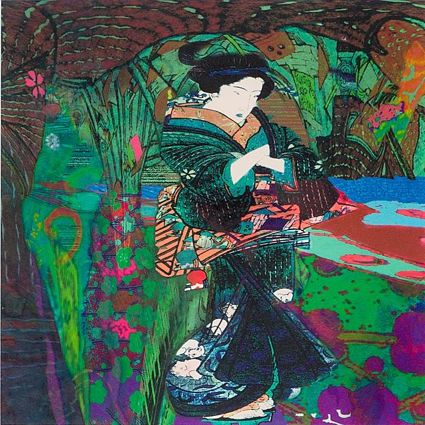

## best of both worlds

Beginning with depictions of Edo’s Floating World, Helga Kopperl has built a bridge of color and light across time and culture. She’s created a new space out of the old &mdash;  a space that incorporates the elegance, lyricism and vitality of the ancient Japanese art form and updates it. The resonant results conflate the past and present in unexpected and novel ways.

> Throughout the series, Kopperl's unique interplay -- between woodblock Ukiyo-e prints and bright, new digital techniques -- achieves a surface tension that coexists with a suggested deeper bottom.

Her endeavor breathes new life into the geishas, samurais, kabuki actors, sumo wrestlers and other denizens of a bygone era. Kopperl appropriates calligraphy, designs, and motifs, transforming classic woodblock prints into startling new constructs. The bold transformations feel hauntingly evocative of former times, yet contemporaneous and reflective of our own society.

   
BRIGHTHOUSE

In the 15 compositions in the series, the artist has chosen ideas from woodblock prints and digitally collaged them into impressive originals. The selected segments are shaped and then tweaked for color, tone and temperature. Sometimes white negative space looms, like the open passage in *MAGNOLIASHOULDER*. In others such as *BORDERGATE*, numerous transparent and opaque layers are piled in dense frontal heaps.

Like projections onto translucent screens, the images dance and weave over and under one another. In *BRIGHTHOUSE*, a geisha stands, arms folded and resolute in a dreamy landscape of stains and patches. Complementary colors, scarlet and forest green, ripple around the figure. The folds in her dress enhance an atmosphere of mysterious landscape receding into depth.

The surface gives way to a rich array of marks and forms as if the viewer is looking into a pond or a rainy puddle. Indeed, *MOONDIARY* with its interlocking sea-green scallops, glimmers in refracted planes. Throughout the series, Kopperl achieves a surface tension that coexists with a suggested deeper bottom.

In *FLORABUNDA*, however, the opposite sensation is achieved. The central images appear suspended above an opaqued background. Arbitrary shapes that resemble scimitars or eggs roll across a jumbled but gemlike landscape. A typically lush palette animates the dominant elements.  Orange and yellow decorative passages abut purple and turquoise floral designs.

Richly patterned kimonos, flowers, fish and bonsai trees are all reconfigured into abstracted samples. Kopperl’s most compelling new configurations invite the viewer to explore unforeseen connections. Ultimately, sections of the collaged pieces are used almost like brushstrokes to create patterns. This is especially apparent in latter pieces of the series that exert swirling vortical pulls such as *LOOSENEDCLOUD, DAYWHEELS,* and *KABUKIGA*.

*BLINDCHILD* relates to an early Hokusai print, *36 Views of Mt. Fuji*. The flat orientation of this print contrasts with the circular or concentric elements of the Floating World. Like whirling ribbons pegged to a center, crashing waves are sucked into a disappearing tunnel of spume and flowers.

This circling whirlpool is a metaphor for our journey in life. Ghosts and blossoms from long ago are blended with desires and aspirations of the present. Kopperl rekindles delight from embers. In the process she creates contemporary phoenixes that are breathtaking to behold as they soar toward the future.
