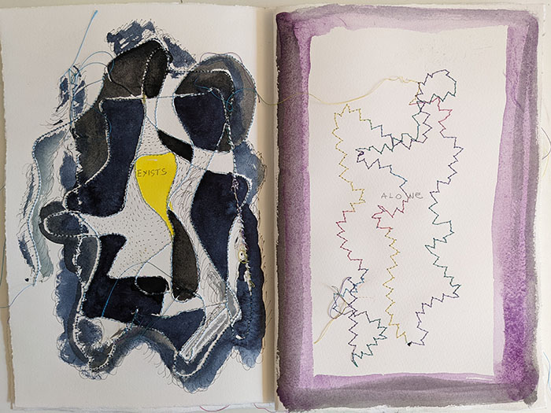
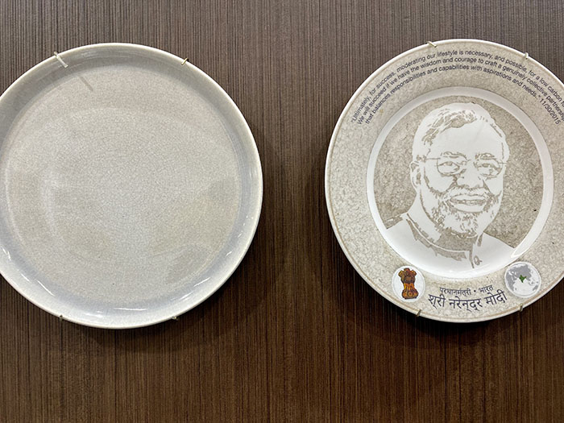

**In Nature, Nothing Exists Alone**  
(from _Silent Spring_, by Rachel Carson, 1962)  
[NYC Culture Club](https://www.nyccultureclub.com)  
January 27 - March 7, 2022

Curated by Laziza Rakhimova and Chris Costan  
Artists: Kim Abeles, Olive Ayhens, Elena Berriolo, Chris Costan, Kris Graves, Valerie Hegarty, Betsy Kenyon, Oskar Landi, Christopher Lin, Lenore Malen, Laziza Rakhimova, Tattfoo Tan, Marion Wilson

This show of a baker’s dozen, endeavored to wed aesthetics and environmental awareness and was largely successful. The work was by turns informative, spooky, prescient, and handsome.

In an accompanying statement, Chris Costan wrote that all the works “demonstrate the urgent need to live more responsibly given the Earth’s finite resources.” All of the art was informed by the urgency that is part of our collective zeitgeist in facing the existential threat of multiple ecological disasters and possible extinction of our species.

Collaborative performance by Elena Berriolo: accordian book created on-site.

The approaches varied from the vivid, Mordançage-altered photos of Laziza Rakhimova to painted and sewn pages by Elena Berriolo. Some artists used nature itself as a paintbrush. Oskar Landi created a machine to extract microscopic plastic filaments from Arctic waters. He then photographed the isolated material on the heads of pins and enlarged the images. The pervasiveness of our pollution is made manifest — and the implications are dire. Betsy Kenyon used the tides off Governor’s Island to make marks on mylar in a cliché verre type of semiphotographic printmaking.

Also using the elements in a similar manner to Kenyon’s marked surfaces, Kim Abeles used smog as pigment. She began experimenting with the _Smog Collectors_ in 1987. She places stencils on top of blank plates which are situated on roof tops in various cities. Days or months later she removes the stencil and the images appear in the deposited smog. Apparently, World Trade Center execs vetoed images of Putin and Trump. The exhibition space directors replaced them with blanks.

>...like a portrait of invisible irony — the vacuum humans are blithely accumulating.

At first blush, Valerie Hegarty’s wall sculpture appears to be made of wood but it’s actually epoxy clay and other materials. Roots protrude and branches twine together but join in an unnatural (rectangle) configuration. It’s like an empty frame — a portrait of invisible irony — the vacuum humans are blithely accumulating.

It’s encouraging to see these artists confronting aspects of our planetary degradation in innovative, thought-provoking, and visually arresting ways. Artists addressing our increasingly alarming situation are worthy of  expanded and continuing attention. This is the best show regarding our very survival that I’ve seen.

The exhibition will be expanded for a  redux at the United Nations later in 2022

Kim Abeles _Smog Collectors_ 

