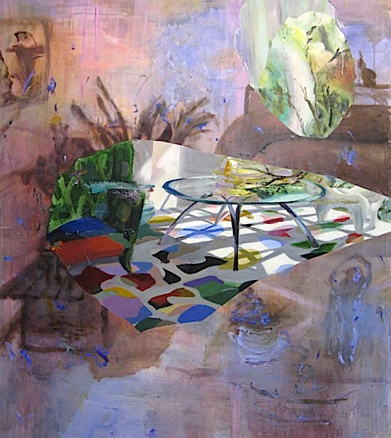

## majesty at the brink of chaos
[Edward Thorp Gallery](http://www.edwardthorpgallery.com/) Chelsea, NYC

Evoking the brushwork of John Singer Sargent, and the spirit of late Philip Guston, Judith Simonian is the fever-dreamed salon painter of J.G. Ballard’s dystopic High Rise interiors.  Simonian produces ambitious, head-spinning re-conceptions of tabletop still-life, interior, and landscape painting for the 21st century as Matisse did for the 20th century. Though she is no newcomer to the art community, the month May marked the first opportunity to see an entire solo show of 16 acrylic on canvas paintings ranging from a foot to 7 feet wide. 

*Multicolored Carpet*, 2013. Acrylic on canvas, 72 x 64 in. Courtesy of Edward Thorp Gallery

In quantum physics the "Many Worlds” theory proposes that there is not one universe, but many, in parallel, offering alternatives to everything--simultaneously. Adept at making harsh ruptures and jump-cuts in space, time, and subject, Simonian has the ability to convey the complexity of “Many Worlds.” William Burroughs explained that “when you cut into the present, the future leaks out.” Simonian’s “leaks” of the future include surprising parts of the past and present. Unpredictable elements of unknown eras and areas such as mountain peaks, lounge chairs, ship prows, carpets, and fleshy, flashy, iridescent fish all co-inhabit the compositions. 

In *Multicolored Carpet*, a large work completed earlier this year, Simonian allows a viewer to look into the thought process--as one image supplants another. In the upper left corner, a small, framed profile of a man’s face looking at a woman with her arms up offers a cue. An enriched grisaille interior at twilight is sketched in broad loose brushstrokes and drizzly washes that bleed into one another. A modernist, slatted bench with large plants recedes from the front left while a simple streamlined sofa fills the indeterminate background on the right.

The scene is interrupted by a much more vivid, full color image hurtling into the center of the — just as a strong memory supplants one’s view of any immediate but less compelling “real” environment one is in.  This color image is drenched with strong afternoon sun casting traceries of shadow through a circular, lens-like glass-top table. Shadows of the table and the mullions of an unseen window splay across a white carpet patterned with lively-colored biomorphic shapes. 

In the lower right, small ghostly sketches of a two-handled (armed?) mug and another female form with uplifted arms shimmer and disappear as if small arrested thoughts stubbed-out liked half-smoked cigarettes. Tiny brilliant ultramarine flecks dance across the canvas like the flickering floaters one encounters in one’s eyes after having looked too long or hard at a brilliant scene. This brilliant scene is more packed with memories of images than with immediate life, itself.

Aware of history, yet not bound by theory, Simonian parses out the universe directly with her paint. Her tough compositional and color decisions result in works with a rugged, feral beauty. Just as an animal will coldly, calmly chew off its own leg to escape from a spring trap, time and again this artist will “chew off” or destroy part of her own beautiful composition in order to escape the trap of any sort of conventional resolution. And, she invariably returns to invent something shockingly different and better to replace it. She is willing, as few others are, to cut off obviously gorgeous passages at the knees or to shift color palettes from warm and luscious to acrid and acidic to lurid and florid all on the same canvas. These paintings rest magisterially at the brink of chaos. 

