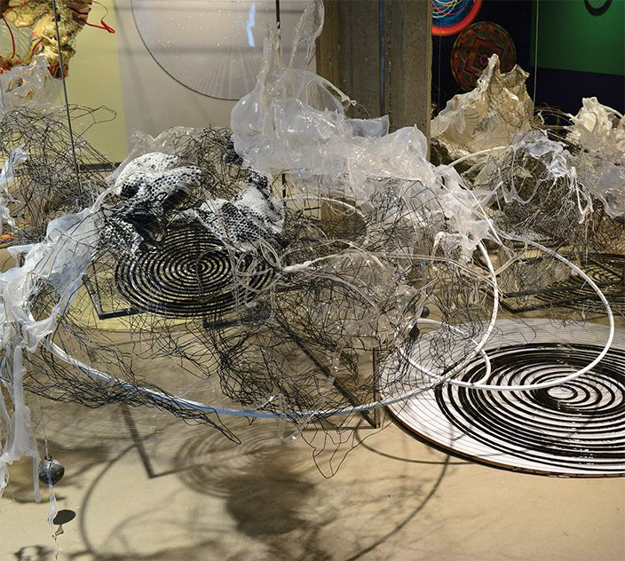

*Somewhere After*   
At [Lafayette College](https://communications.lafayette.edu/2016/03/09/judy-pfaffs-somewhere-after-featured-at-lafayette/), Easton, PA

Judy Pfaff’s art requires several kinds of understandings. First, let’s think back to primordial installations &mdash; cave drawings and dwellings, rituals in China and Southern Africa and Native American ghost dances in buffalo robes. Think about Egyptian rulers who carried with them to the afterlife their slaves, dinner service, and fortunes. Think about caves, teepees, and tombs as original installation or performance spaces. Think about Tibetan Buddhists imagining the cosmologies of heaven.

Next, let's think about the histories of art &mdash; about the periods, the decors, the painting and sculpture, and the layers of imagery up to the present, including Japanese and French cultures, and naïve artists like Henri Rousseau whose images fit so well between Picasso and Matisse. Add in geometric and abstract and conceptual kinds of art that somehow are universal and don’t exactly fit one time frame.

Further, let’s consider earth: its geophysicality &mdash; mountains, rivers, oceans, sky, air; its flora and fauna, its vast array of trees living inside, on, and above the earth: nature in abundance &mdash; its seasons, its moments of living and dying, its procreation and fruiting. Finally, there are the wonders of space and the imagination, of medicine and science. 

In other words, if you think in every direction and then create your own cosmology that both surrounds and frees its viewers, you have some idea of what Judy Pfaff is doing these days.

 I missed seeing Pfaff’s early days at Holly Solomon’s in the 1960s, but I witnessed and wrote about her 1997 Andre Emmerich show on 57th Street, for which she totally transformed the space, including holes in walls and a huge dead tree with its roots suspended on chains in a middle gallery. Pfaff went on to create installations from Sao Paulo to Wyoming to the Barnes Collection in Philadelphia, where her fanciful version of Mrs. Barnes’ exotic garden is, perhaps, the only tribute anyone has ever paid to Mrs. Barnes. So each installation of Pfaff’s art is about entering worlds that have their own kinds of rhythms, symbols, objects, and colors.

>...each installation of Pfaff’s art is about entering worlds that have their own kinds of rhythms, symbols, objects, and colors.

"Somewhere After," at Lafayette College in Easton Pennsylvania, is a creation myth. At the entrance is the upside-down roots of a dead tree decked out with colorful materials. It looks more like a chandelier since the roots seem to be branching and rising. The gallery space may be navigated in clockwise or counterclockwise directions.  Metal geometric straight "lines" overhead mark this maze and create sight lines which change altitude and then spiral onto the floor in a central black and white space which shows an Egyptian leader’s possessions &mdash; his dogs, ducks, men, rams, lions, and his world. This black and white section shows a rigid hierarchy, inequality, and absence of color/life. 

Back at the entrance, the upside-down tree roots are shallow. Perhaps they didn’t have enough room to grow or perhaps the tree died due to turbulent weather or old age.  Trees sometimes live longer than humans, but they, too, are part of the cycle of life and death. The roots are cloaked in extruded foam, an earthy eggshell, orange, and green mass that has basketlike forms of green, orange, and blue orbs in its arms and two spheres or primordial ooze at its base. This may symbolize earth’s wonders. A pendulum, which Professor Robert Saltonstall Mattison of Lafayette College calls Foucault’s Pendulum, is suspended over the roots, and two other pendulums are in another mass diagonally across the gallery.  Foucault’s Pendulum dates from 1851 and demonstrates earth’s rotation, yet is also the title of the Umberto Eco 1988 novel that is the antithesis of gravitational pull and, instead, about esoteric and conspiracy theories. The area diagonally across may be notions of heaven; it has a large Tibetan mandala on the floor and a plastic spiral that goes up. As in the entrance sculpture, orange, green and blue predominate. The ooze on top rises high and bursts into rainbows of color.

Going around the room in both directions, orbs of vision abound. Some are highly distorted circles of Henri Rousseau’s world of plants, some are abstracted or figurative Tibetan mandalas, some are pure op geometries that seem to recede and advance into the space. In many, there are circles within circles that either collide, cross, or float together in concentric rings. Glitter and primal slime abound. There are immense rounds of roundness, multi-verses we can peer into, the ochre and green and white swirls become, in undulating variations, original gardens.

The exhibition title "Somewhere After" suggests an open narrative starting with the big bang &mdash; or however you imagine the origins of the universe.  Pfaff’s many accomplishments and honors may be found on [her website](http://www.judypfaffstudio.com/) and at [Art 21](http://www.art21.org/artists/judy-pfaff).

