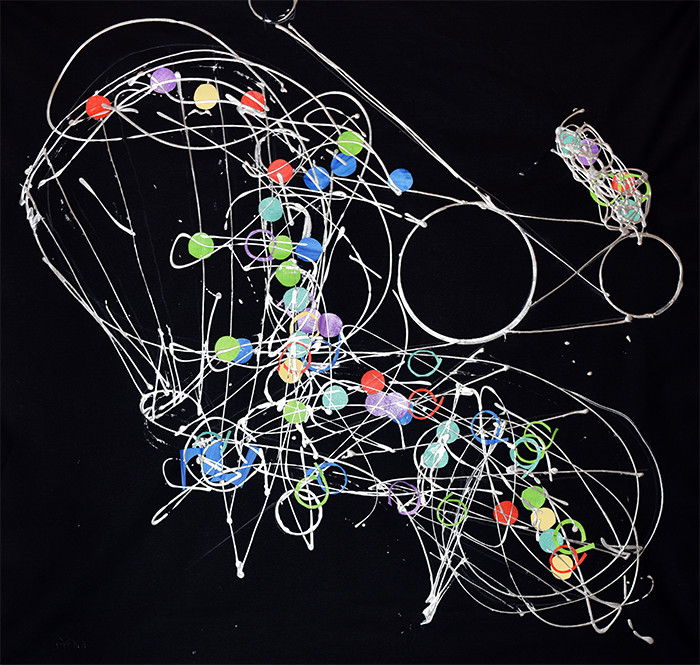

The Yard, Herald Square, NYC
Does Judy Rifka need to bother with the articulate justifications and cogent explanations that always accompany her latest creations? Not for this fully alive and eye-popping show, thanks to curator Gregory de la Haba. Elasticity reaches across decades of her art, revealing that it’s not a coincidence that Rifka has morphed through the years with ideas not flighty or fickle but ethereal and subject to necessary changes one might mistake for something else — if they didn’t know their stuff. People who do, know that her perennial voice, eye, and hand are deadly serious about mark-making and art-making by whatever means necessary.

What is necessary in this show, is that the paintings &mdash; mostly current works and examples from her rich history &mdash;  are metaphors for her career: constantly shape-shifting, meta-morphosing and evolving vectors that swaddle turbulent energies like choppy waves atop an ocean secretly grounded by still waters murmuring deep below. 

An ever-changing yet stable presence underlies undulating lines, strong shapes and sudden darts of color. The artist’s confident approach provides dependability against shifting cultural winds. Attitude embraces the wisdom of the ages or undoes it as needed. Techniques and tools, uniquely combined and arrived at intuitively, tell layered stories. Her stand, as always, is for a kind of holy but irreverent geometry. She plays with it but also sends it up or on its way, paying homage to and suggestive of all science with genuine Bezier curves evoking gowns, teepees or diagrams of ballroom dancing. Or all three moving with All-American defiance.

Judy Rifka points from within fake science toward dimensions reached for by predecessors. Dreaming of folds and hulls and Leonardo, she pictorially articulates Naum Gabo, Tatlin’s Tower, and Duchamp’s malic moulds and chocolate grinders &mdash; all flattened by wild Fauvist slam dances.

