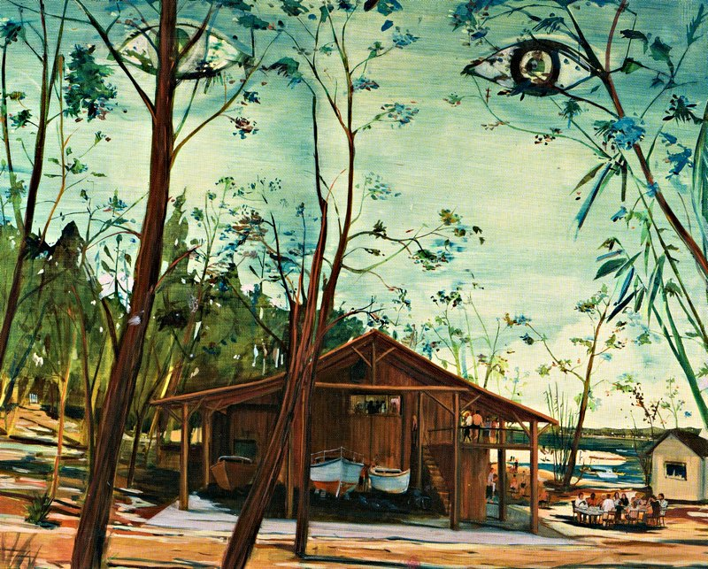

---  
title: "Jules de Balincourt"
author: "Jeffrey Cyphers Wright"
date: 2014-07-07
template: article.jade
absurl: https://reviews.livemag.org/articles/jules-de-balincourt
---

True to the title of one of his paintings, *Land of Many Uses*, Jules de Balincourt finds divergent scenes to convey a complex, sophisticated artistry. The 75 color plates in the book *Jules de Balincourt* show the artist commenting on class, circumstance and connection with refined aloofness. Cool by nature, he often depicts the cool. In one completely seductive vignette, a white yacht and its owner bob peacefully as white fireworks spill from a night sky.

 
*Utopia Tyrannique*, 2010 oil on panel, 48 x 58 in. Courtesy Skira/Rizzoli

These paintings from the last decade attest to de Balincourt’s diversity while examining the way we live as a species. Arenas, board meetings, and terrace parties teeter into Orwellian narratives. *The Boys Club*, with its men in suits and ties, lauds success while hinting at injustice. Bright orange walls heighten a sense of both excitement and foreboding.

In *Global Hunter*, a roomful of animal trophies becomes a trope for the bad "good old days." While the corridors of power are fair game for this artist, he rejects lampooning. The results are more nuanced, mixing beauty and ugliness in a seamless contest. 

In examining how we live, the artist is especially conscious of our attempts to define space in terms of the collective. An interest in the pursuit of leisure (soccer stadiums, biking, boating) recalls classic artistic themes while *Naked Protesters* humorously deflates the holiday atmosphere. Going further, de Balincourt depicts both "Insiders and Outsiders," in a painting of a prison. In another piece, flood victims wade through a panoramic vista, evoking angst about our species' predicted perils.

For an artist to be considered the "conscience" of his or her time, he or she must stir reactions to inequities. De Balincourt does this while maintaining a smooth, soothing sense. Andrea Scott writes in a preface, "de Balincourt’s gimlet eye is counterbalanced by equanimity." Behind a patina of foreboding, one can find in these paintings, welcome places to rest the eye. 

It is ironic that street methods such as spray paint and stencils help make up the arsenal with which de Balincourt arrives at these pleasing paintings. He has forged a style that is resolute but baited. A disembodied touch lingers over the works, suspending them in a timeless vacuum even as they transport us to the border between utopia and dissolution.