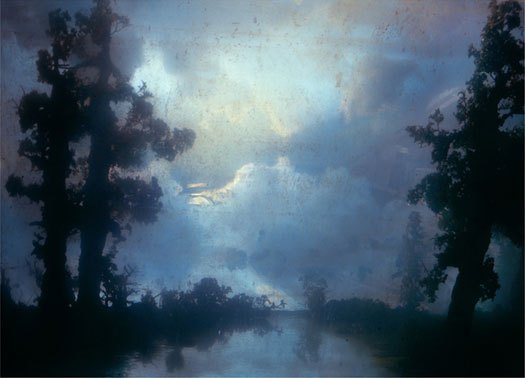

[Kinz, Tillou and Feigen](http://www.ktfineart.com/artists/kim_keever/)
## Nature calls in Kim Keever’s landscape photos of submerged dioramas
Human nature is part of nature but is also painfully apart from it. We are always aware of our separation from the innocence and sanctity we associate with nature. Art tries to address that longing, most especially in representational, landscape paintings. 

Landscape as a genre may seem out of place in the modern world, but it was top dog in the days of the Hudson River school when America’s character was being forged by the notion of a vast and endless wilderness. Contemporary landscape still claims its painterly heroes like April Gornik and Rackstraw Downes. Celebrated photographic practitioners of landscape include Emmet Gowan, Richard Misrach and Victoria Sambunaris. 

Then there are photo manipulators and photographers building sets like Thomas Demand and Didier Massard. It is this latter category that Kim Keever is roughly aligned with.

   
_Forest 83c_, C-print. Courtesy Kinz and Tillou

This November at Kinz, Tillou and Feigen, landscape is getting some new attention. In addition to showing Hudson River School paintings in collaboration with Godel & Co. Fine Art, Kim Keever’s latest photographs of his models are on view. 

It’s an ironic update on the venerable landscape tradition, because at first blush Keever’s photographs read as throwbacks. Big and billowy, cloud-filled vistas of a pristine corner of the world, they relate directly to Albert Bierstadt, Thomas Cole and Frederick Church. Uncut versions of Eden, no sign of pesky humans disrupts the preternatural awe. Only rocks, plants and atmosphere inform these regions.

It’s hard to tell that these scenes are not actual places. But in fact, they are dioramas that Keever has constructed in a big fish tank and photographed. Only Andres Serrano has thus far made it by submerging subjects (remember *Piss Christ*).

### symphonic pitch

Keever assembles his dioramas using twigs, rocks and plaster that he sculpts to resemble mountains, cliffs and boulders. He also loves to visit the model railroad store where he finds convincing plastic plants for his compositions. Clouds are cotton placed behind the tank. Lighting effects amplify the illusions. Much of the light’s delectable hues are achieved by pouring pigment into the water and letting it disperse.

By reframing the concept of the natural world, Keever has restored a sense of wonder to it. His depictions of environments ring with the exalted pitch of a full on symphony. Here, the artificial engages reality through a hyper-contextuality. Time and space are conflated.

These are not old paintings of real places although they conjure past masters. They are instead inventive portals of desire. They are addresses of the imagination where we can examine philosophical conundrums about what we worship and why. They are exceedingly lovely and over the top. And that works.

As leavening, a graceful distance from beauty is maintained by the faint scuzz marks that Keever leaves on the fish tank’s inner walls. This secondary surface of ethereal slime adds a requisite grunginess to the product while highlighting the process. It also adds the illusion of the passage of years, implying survival and thus imparting a sense of greatness to the artwork. All of these commingling associations blend together to form a warm, but sharp focus. The closer you look, the more pleasing the assembly of visual “information.”

### virgin allure

*Forest 83c* evokes a delightfully primal feeling with its lure of virgin territory. Layers of cloudbanks bulge around an emerging moon. Its effulgence is perfectly located between a couple of tall pines on the left and a leafy giant on the right. As in Turner’s atmospheric pyrotechnics, the sky is unabashedly glorious. Layers of cascading clouds are bathed in robin egg blue, periwinkle and lilac, indicating a transient time like dawn or sunset. 

The bewitching hour is played up. Everything is heightened to the point of a silent crescendo. A placid stream recedes down thicket-dense banks. Gnarly branches posit a surge of ragged silhouettes against the immense curtain of evening as it ascends. Our eye is lead to the diffuse horizon that pledges a rendezvous with the sublime.

Fog grips a ridge in *Wildflowers 52i*. The mist has opened enough for us to see a throng of bright flowers filling the foreground. Tropical in their brilliance, they are spotlighted, creating an animated intimacy. They communicate an inviting sense of purity, elevation and anticipation. They stir us. In the distance a mountain looms through a break in the clouds, beneath a promising patch of blue.

Conceptually, Keever has re-framed our appreciation of wilderness areas by mythologizing them. Again, the artist leads us to contemplate an ideal--a transcendent place we would really like to see.

