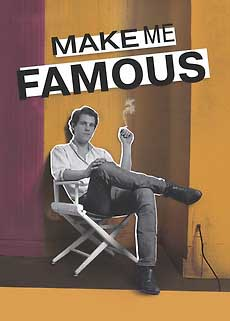
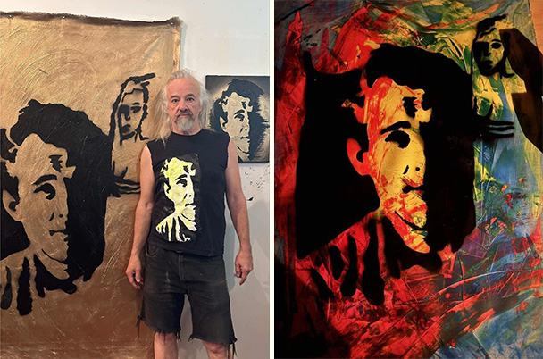

For everyone who has ever chased a dream with all they had, *Make Me Famous* will move you. It’s the saga of one Edward Brezinski, an aspiring painter—but it’s also an archtypal story of a kid striking out to make good in the big city.

<figure>
  
  <figcaption>
*Make Me Famous* 2021 Film  
Directed by Brian Vincent  
Angelika East Village, 2024  
</figcaption>
</figure>

The East Village of the late 80s and early 90s was a cauldron of creativity. There were 80 galleries in the neighborhood. The punk scene was exploding. Allen Ginsberg was hanging out at CBGBs with Patti Smith and Richard Hell. Richard Hambleton’s shadow figures lurked between the trash can fires and broken bottles—the sleeping bums and sleepless punks that defined the East Village as a place of danger and wonder. Anything was possible.

Edward was a product of that time, when fortunes and icons were made overnight. So many heroes come through the lens. Keith Haring, Jean Michel Basquiat, Patty Astor, Gary Indiana, Rick Prol. There’s rare footage of openings at Brezinksi’s crumbling apartment/ salon by Jim C. Former lover Allen Frame’s photos capture a handsome, troubled young man.

People chased fame and companionship in wrecked storefront galleries like Nada and Chronocide, B-Side and Gracie Mansion. The film resurrects the grit, fervor and glory of the East Village 80s heyday. And Edward, with his soft voice and movie-star looks, knew everyone. 

Artist couple James Romberger and Marguerite Van Cook lead this excursion, taking us into a deep dive back to that time to paint this aching, gorgeous portrait.

<figcaption>l: **Jim C.** at work. r: Portrait of Brezinski by Jim C.
</figcaption>

James and Marguerite showed Edward at their Ground Zero Gallery. The man got around. I had him in a show myself at the performance space called Darinka, (curated by Baird Jones). 

The filmmakers, Brian Vincent and Heather Spore Kelly, have done a masterful job.The twist at the end comes as a complete surprise, making this a bit of a whodunnit as well as a documentary. In fact, the detective work and its resolution, ties this gift up with a bright bow.

Vincent and Kelly have taken a fairly obscure painter and given us a fairy tale full of bravura and despair. Immensely triste but ironically triumphant, Make Me Famous is a moving testament to hope and the artistic spirit. God bless Ed Brezenski, who stands for all the unknown, deliriously ambitious artists who devote their lives to a dream. What a tour de force. 

