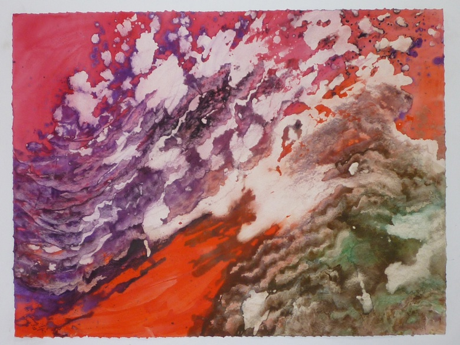

[ACA](http://www.acagalleries.com/past-exhibitions/year-2012/marlene-tseng-yu-forces-of-nature/)
## communing with the elements: Yu's irrepressible vision

Artist Marlene Tseng Yu is unique in her ability to merge the traditions of her ancestral Chinese culture with Modernism. Her exuberant and vibrant paintings reflect Abstract Expressionist practices while offering the viewer a narrative that has its nexus in nature. Her new show at ACA Galleries, called &#8220;Forces of Nature,&#8221; includes work going back from 1971 to the present. 

   
*Molten Lava*

A deep bond with the physical world has informed Yu&#8217;s metaphysical vision for over four decades. She organizes ineffable scenes that suggest a correspondence in the natural world. For instance, in <em>Molten Lava Park</em>, the title tips us off. A black and white center seems to be heaving up from an explosive background, like lava pouring out of a vent in the ocean. Blocks of ridged grays seethe under a magpie crust of black and white. Vertical rhythms recall the crystalline forms of lava chimneys.

Yu varies her marks considerably, adding to the perception of artistic control over phenonmenological chaos. Amorphous clouds and fiery washes contrast with concise shards and irregular recessions.

Within her lexicon, an overall impression of activity is maintained. In <em>Sunken Treasure</em> the ridges become tighter and are crossed by rows of brown and jade (like the bands of color in a turkey&#8217;s tail feathers or the accretion lines of an oyster shell). Once again, magpie sections resembling the random markings of a dairy cow, swell to the surface, this time pushing the central image back instead of forward.

Within the shell-like facets, ruby and scarlet forms emerge, resembling the wavering tentacles of a sea anemone or the jeweled flanges of a vagina. These divergent interpretations attest to the artist&#8217;s skill at conveying nature, recalling Georgia O’Keeffe’s metaphoric and compositional mastery.

What’s more, Yu activates the spiritual component that we seek in nature. Whether invoking the cosmic or the microscopic, the constant flux of matter finds eternal equilibrium in Yu’s powerful expressions.

In &#8220;the age of mechanical reproduction,&#8221; the act of pure painting is cause for celebration. Marlene Tseng Yu is a pure painter. She provides an invaluable link to our collective comprehension of what can be intuitively ascertained with the mind&#8217;s eye.
