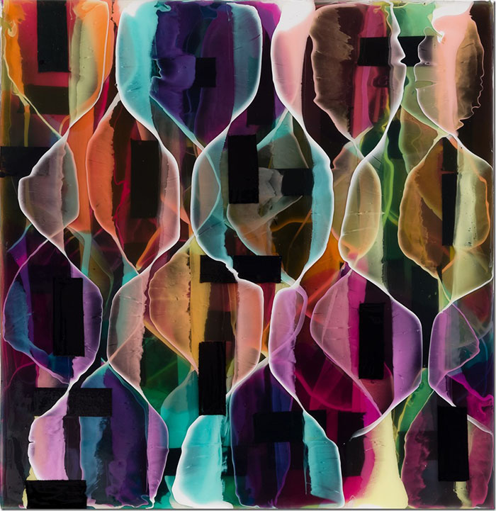
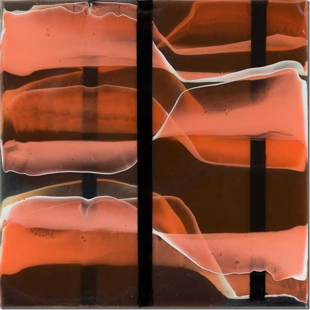

__Maureen McQuillan: Two Ways About It__  
[McKenzie Fine Art](http://www.mckenziefineart.com)  
April 9 - May 15, 2022  

*Untitled (TW/VTYO/PM)*, 2021, ink and acrylic polymers on wood panel, 15 1/2 x 15 inches

I recognize Maureen McQuillan’s mid-century palette in her solo show of new work: process printing colors, technicolor, and muted, natural tertiaries created in layers like stacked sheets of translucent, differently colored Plexiglass. Her palette also recalls the thinned washes of the color field painter Morris Louis.

The paintings’ lustrous, glassy surfaces are immediately alluring. While their shine is reflecting, they take us into their depth of about a half an inch of resin-like acrylic, treating us to watery-looking environments. Repeating, diaphanous elements fill the panels end-to-end, intimating infinity. With measured spacing of the  elemental forms, she’s added geometry and rhythm.

>Repeating, diaphanous elements fill the panels end-to-end, intimating infinity. With measured spacing of the  elemental forms, she’s added geometry and rhythm.

The press release tells us that McQuillan “systematically distributes” pure ink colors in many layers of clear acrylic substrate onto black painted panels, incorporating opaque white lines. All of this blends optically and chemically. To some degree she lets the materials do their thing, relying on chemical actions to generate some imagery.

McQuillan gives us forms that we might interpret subjectively. I imagined natural forms. My companion saw glasses and portals.

We bring our own fancies: stacks of wine glasses receding in rows, layers of 4-color printing ink in a matrix; DNA or other suggestions of Mother Nature. The paintings’ mirror-like gloss helps us personalize the viewing experience. We can imagine the green-tinted elements’ curvy outer edges ruffling like kelp fronds in the ocean.

In small, nearly monochrome square paintings featuring salmon or pink tints, McQuillan zooms in on suggestions of flower petals, vulva, or clams or jellyfish opening and closing for nourishment. Here the elements are less apt to form patterns we find in the larger more complex works. The close-up views are immensely captivating.

*Untitled (TW/O/3B)*, 2020, ink and acrylic polymers on wood panel, 10 x 10 inches

McQuillan’s interest in posing opposites is intentional.  We see it in the yin vs. yang of softly-pooled, colored veils in curvilinear life-like forms that butt against opaque black shapes or stop at sharp white borders.

Trapped in the painting’s half-inch depth, the potentially precarious is contrasted with the inanimate. The *oui* with the *non*. The optical weave of twisted wafer-thin ribbons in the substrate. The warp of static posts and deep dark backgrounds—voids in time and space.

Black, hard-edged bars and rectangular patches give the whole a gravity. They add a code of redactions, pulling back the sweetness; harbingers of something amiss, disrupting the natural flow. We can foment compassion, for example: for the lives of pregnant women and for the environment. Because that’s where we are in 2022.

McQuillan’s conceptual intelligence and rigor becomes evident the more we look and think about these complex works. Even as their sheer beauty feels life-affirming.

