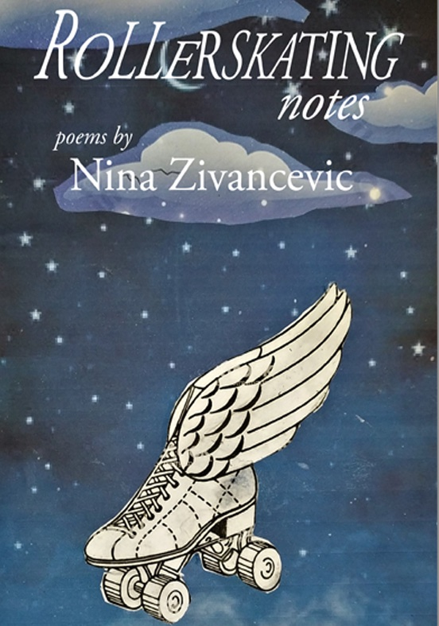

#### Nina Zivancevic's Roller-Skating Notes

Poet, playwright, fiction writer, translator, scholar, performer, curator, and art critic, Nina Zivancevic is also the winner of the 2021 Centre National du Livre grant for creative writing (poetry domain) for a project titled, “The Source of Light,” after the Syrian poet Nouri al-Jarrat who writes: _Poetry is the only source of Light!_

<figure>
  
  <figcaption>
*Roller-Skating Notes*  
by Nina Zivancevic  
[Coolgrove Press](https://coolgrove.com/books/rollerskating-notes/), 2021   Brooklyn, NY
</figcaption>
</figure>

If you know Nina “Zee” or heard her read her poetry, you will recognize her light touch in this latest book of poems. Zee’s voice moves like Yeats’ “long-legged fly”—skating restlessly across the surface of the troubled waters of the late 20th and early 21st century. Whether documenting a bitter truth, delivering a rapier-stab of irony, or eulogizing a lost friend or lover, her poems flare up like the burning ember of a cigarette shared in the dark.

The title poem, “Roller-Skating Notes” sets the tone:
  <pre><em>                 IF YOU wanna skate,…
                YOU HAVE TO HAVE AN ATTITUDE</em></pre>

And Nina Zee has attitude galore. With impassioned imagery (and a sly touch of irony), she can illuminate the inner sanctum of friendship and love. From “Instead of a Photo or a Drawing, on Christmas Evening”:
<pre><em>                The light of reason is flooding my room now,
                Then the ante-chamber and the entire church
                Of my goodwill where the secret altar burns,
                The innermost chapel of my heart,
                You are in it too, shiny with that light
                Brighter than the flames,
                Dangerous to reach and lost to my touch
</em></pre><pre><em>
                You dwelled in it for quite a while,
                Not paying the rent…..

</em></pre>

Humor and irony are always lurking between the lines, under the covers, or around the corner. From “Immaculate Osmosis”:
<pre><em>                Whenever I look at you
                You look at me
                Whenever you start to cough
                I sneeze…
                You talk history of ideas
                I talk the ideas in history
                I like a big black cock
                You like it too….

</em></pre>

Yet all too often, the world and its crises crash down upon her head. In “War Drums or Le Contre-Ataque d’Empire,” she recalls,
<pre><em>                Bloody soldiers and corpses enter everyone’s room
                I was so crushed when NATO bombed my home town
                I barely got my own mother out of that place
                And I believed! Fool that I was, that
                I would never speak a word of English again.

</em></pre>

As an expat/emigrée/immigrant herself (“what is a girl/without her home country?”), she is keenly attuned to the existential crisis of the refugee and the migrant.
<pre><em>                Cedric Herrou
                Is my hero
                he led 123 migrants
                To find shelter and food near Marseille and then he was
                arrested
                8 months of prison
                As it is against the 2012 law to help
                Migrants in distress….

</em></pre>

One poem is dedicated to the late David Graeber, author of the posthumously-published _The Dawn of Everything_, “my anarcho-anthropologist camarade in exile, brother in arms”:
<pre><em>                Was that fieldwork in Madagascar really a lesson in
                              anxiety?
                And is this European field-work tougher than the other 
                              aboriginal,
                Ethical ground where they feed us to the sharks and
                              larks
                disappearing in light dusk of the British lakes?....
                …As if the algebra of heartache had
                To knock down every wall
                And every barbed wire we ran into….

</em></pre>

Finally, there is an inevitable reckoning with time and age. In a prose poem, “Abject/Debris Art 1,” she remembers, _the place…of laughter, soft evenings, sweet gatherings with the like-minded friends, where we, armed with gin and absinthe, shared our latest verses, news, gossip. No point of return there._

Nina Zee calls this volume of poetry her “most socio-political book, as it contains that heavier representation of reality than my earlier work, but this is certainly due to the heavy, heavy times we live in.”

Nonetheless, _Roller-Skating_ with Nina Zee is an invigorating ride through the engaged life of a poet with a contagious _joie de vivre_, a sharp and tender eye for the joy and sorrow of being human.

In her words, _There is a day tender as saffron: TODAY._

  Jessica Slote is the author of _The Body of Loretta_, three plays on the pornography of power, available [here](https://www.tribes.org/shopattribes).
  She is the co-founder of [Loretta Auditorium](https://www.lorettauditorium.com).

