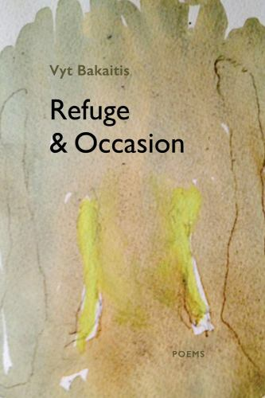

Yes, these poems provide refuge as the title implies — both to writer and reader. Vyt Bakaitis “makes the cave safe.”

<figure>
  
  <figcaption>
<em>Refuge and Occasion</em>  
<b>Vyt Bakaitis</b>  
Station Hill Press  
</figcaption>
</figure>

And yes, these poems rise to the occasion to reveal the impulse that illuminates the occasional and the quotidian, so “the cold truth can assert itself.”

Elegant, erudite, New Romantic, wry—Bakaitis flexes the modern idiom in surges and flourishes of lexical prowess. He persuasively pursues the ever-elusive but always-immediate present. He  wants “to be more in the living.”

The everyday becomes a portal to the profound: (waiting “in line for the cashier,”; “finding the plain word/ I may have overheard”). We also hear a slant classicism in subject and style, showing harmony, restraint, and a serious understanding of form.

The whole emerges from a mosaic made of shards and moments which Vyt fuses into a mythic relief. He massages the language, coaxing out a timeless, epic incantation. An authenticity of immediacy emanates from the occasional moments, isolated and pinpointed. His lines evoke familiarity even as they “stake” out new terrain as in “Scroll Emblem, for Ron Gorchov.”

  &nbsp;  &nbsp;  “framed out to stake risk 
the lines are naked to a flare 
from a keen forge that’s been 
  &nbsp;  &nbsp;  one on one in regarding 
each ghost face to face….”

“Framed” and “stake” are guideposts to the structural style. Together the off-rhymed pair are backed up by “naked” at just the right time for max impact with “face to face.” Bakaitis uses rhyme and meter with surefooted finesse, sometimes subtle and other times overt.

In “Torn Piece for Anselm Hollo” Bakaitis further foregrounds the idea of *framing* as form. He again assembles the essentials into place, focusing on fervor from fresh angles. “To frame in mind a fading hymn to peace … You left us to learn.”

Lyrical and sonorous, Bakaitis bends the language like a dance partner into grace notes: “pulse turned to music” where “night never fails.” There’s magic in them there rills. No doubt. A masterpiece from a master looking back on civilization, survival, love, and human endeavor. Bakaitis has always evoked eternity in a formal yet liberating style. These mature poems sing like crystal spires.
