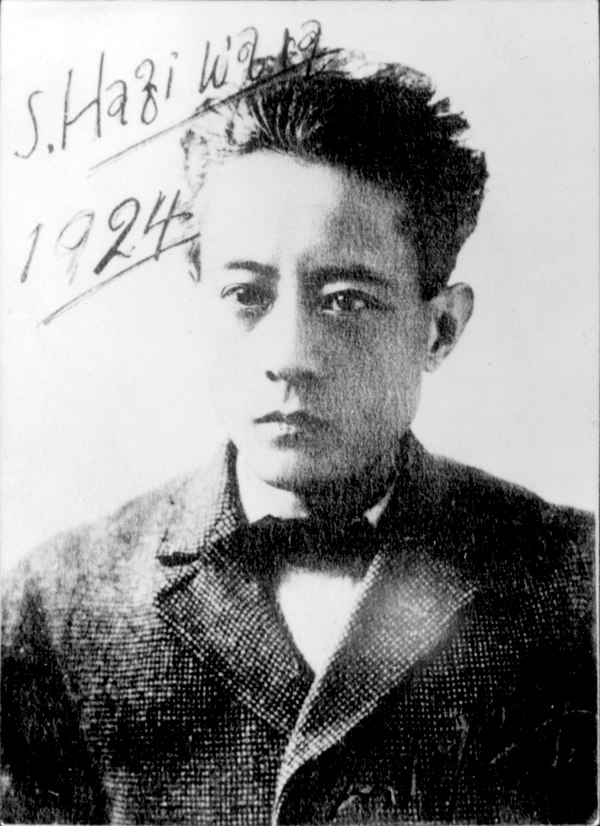

---  
title: 'Cat Town'
author: "Jeffrey Cyphers Wright"
date: 2015-01-06
template: article.jade
absurl: https://reviews.livemag.org/articles/sakutaro-hagiwara
---

"Soaked in tears." How can you beat that? Sakutar&omacr; Hagiwara (1886 — 1943) wrote this line early in his career. His penchant for the piteous remained his trademark. This volume of verse, including the title prose-poem novella, "Cat Town," reveals a genius at joining image with sentiment. His writing produces a profound frisson.

<figure>
  
  

Portrait of Hagiwara, 1924
in *Cat Town*   
Translated by Hiroaki Sato    
[New York Review of Books](http://www.nybooks.com/books/imprints/nyrb-poets/sakutaro-hagiwara/) 2014
  

</figure>

Lachrymose, his malaise drips like cold rain in the slums. It is worth noting (thanks to the translator’s preface) that Hagiwara did undergo serious bouts of instability. Otherwise, the overbearing morosity-- "The Miserable Streetlight," "The Riverside of Melancholy," and "Odious Scenery" --becomes comical, though always formally rigorous and compelling.

Deeply analytic, he explains his technique in prose sections. He compares it to an electrical impulse capturing a rhythm. Alternately he compares it to a phobia or hallucination he is trying to put into words.
 
A lyric Romanticism pervades, populated with feelings of despair and gilded pathos. "It’s a shadowy gloomy district." The countryside is "boring." The wind is "screaming sadly." We too would like to "sob in abandonment." Some poems repeat key words like "sorrow," "fear" and "melancholy" several times. Hagiwara weaves these dispositions into stark, surreal landscapes.

*In a field where bats swarmed    
I watched a pillar of crumbling flesh    
it trembled in the lonely evening darkness    
smelled raw like dead-man’s-grass that flutters at a shadow    
and was ugly as throngs of meat with maggots crawling on it.    
Ah in this landscape that trails shadows    
my soul clutches an itchy terror.* 

Passionate exhilaration pours through the tortured realms infusing the reader with a strange sensation. It’s as if one must perform an oxymoronic double register &mdash; to admit the bracing beauty wrung from misery.

In his preface for *Blue Cat* (1922) Hagiwara writes that he is only a shadow of a reflection of his disconsolation. He is but the "nightmare of a blue cat." His kindred spirit could be Edgar Allen Poe and he was a great admirer of Baudelaire.

An elegiac tone is sustained as feelings of agony are matched with macabre accounts of decay, rot, solitude and dejection. Hagiwara isn’t immune to joy and when he describes this emotion he reveals his deep love for life, providing relief and complexity to his oeuvre. "Spring Evening" begins:

*How joyful to hold this close    
the sensuous yet coquettish air    
a twisted _rubber_-like   rebounding young body…*    

  True to his doleful outlook, he ends: "signs of lust-melancholy sensuous sex / are like cherry blossoms that have bloomed." In "Longing I Walk in a Crowd" he is carried away by the "merry wave." Even here, he is predictably (and endearingly) "moved almost to tears."

Superbly translated, this collection provides an overview, including poems from Hagiwara’s first book, *Howling at the Moon*, which was very successful when published in 1917. The startling imagery and clear descriptions were critiqued as being "true symbolist poetry written in Japan for the first time." Innovative and uncanny, the writings remain shocking and unique. 

