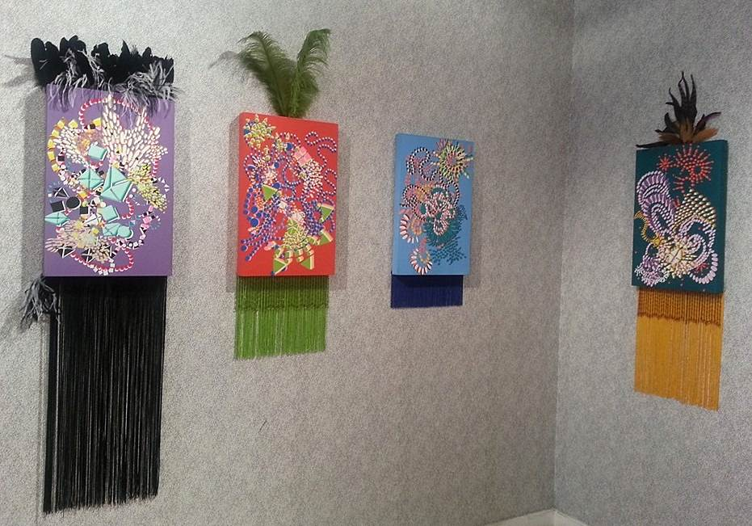

A show of Suzan Batu's easel-sized paintings creates a mood of worldly coquetry at [The Phatory](http://phatory.com). It looks like the artist may have started with a straight and narrow method, and then took it south &mdash; finding her true colors.

Batu, a respected painter with a mature career and a recognizable iconography, divides her life and work between New York and Istanbul. 

The small paintings look portable in more ways than one. They offer a fresh perspective, a window for viewers (outsiders) into another culture. And it goes beyond her previous references to the calligraphy and sinuous curves of her Byzantine heritage.

Actual costume elements adorn these portrait-oriented works, which mirror the viewer up close at eye level. A few large color-coordinated feathers sprout from the would-be head. She’s also tucked a gleaming skirt of beads under the bottom edge of the painting. 

The bodies of the works, the paintings themselves, are compositions of reactive colors applied within hard-edge shapes that are perceptually mutable. Strings of these spherical, bead-like shapes meander to the fore and mutate in a riot of energy and abandon.  

Batu has disrupted the rules of color and how it is supposed to create the illusion of depth. In these paintings, dull gray-greens sit smugly atop shadows of brightest lemon yellow. In the most complex and satisfying works, the shapes shift, arriving at the foreground as expanded squares or diamonds. They are layered and offset, like exploded 3D views. The colors defy the normal rule that warm colors come forward and cool colors recede. The rebellion and the resulting skewed perspective is both unsettling and dazzling. The paintings have monochrome backgrounds &mdash; orange, red, green, or other &mdash; and ethereal, velvety flat surfaces; yet they hold illusion.

The strings resemble novelty notions and costume jewelry. On another level, they are humanoids born of Batu’s previous lexicon of swirls.

These new works pack a punch, for all their small size and intimate scale. They fit the tiny gallery space more comfortably than the large works in her last Phatory show. A more personable scale supports their friendly countenance and they sing a deeper song. 

The paintings sizzle, dressed for the dancehall. The outsized feathers and beaded fringes ultimately convince. Without the accoutrements, we would miss some of the fun. 

Yet, the paintings are presented on their own in a fitting catalog for the show, introduced with a Rumi poem. In a few lines, it helps locate these works as global citizens.
