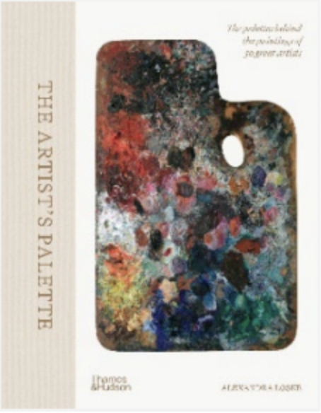
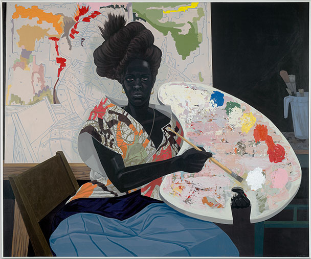

*The Artist's Palette* is a new exploration of color by an engaging storyteller and scholar, Alexandra Loske. She’s a researcher of women’s role in the history of color at the University of Sussex, England. At  just 248 pages plus copious endnotes, the brief but encyclopedic book comprises short studies on 50 artists ranging from the 1500s to the present. Loske is also the curator at the Royal Pavilion in Brighton. And here she focused on a particular object, the artist’s palette—approached through a Eurocentric lens.

<figure>
  
  <figcaption>
*The Artist's Palette*  
by Alexandra Loske  
[Princeton University Press](https://press.princeton.edu/books/hardcover/9780691263960/the-artists-palette)  
Image @Thames &amp; Hudson</figcaption>
</figure>

The book is divided into chronological sections not by art movements but by palettes—literally (as a tool for mixing colors) and figuratively (as the artist’s color vocabulary). The earliest palettes were “Tonal,” later “Dynamic,”  then “Experimental.” and finally “The Liberated Palette.” 

That five of the thirteen artists in the earliest section of this book are women is welcoming. This is an important contribution—in a general history that’s not a book about women artists. In 2024, that’s still a distinctive feature that Loske brought to her already unique and creatively presented subject.

The book abounds with interesting factoids. Some may swoon while reading that Rosa Bonheur painted in a studio in the *Forêt de Fontainebleau* that she bought after selling *The Horse Fair.* Monet started out painting in a tiny houseboat studio on the Seine, depicted in his self-portrait *The Studio Boat* from 1876. But by 1916 he worked in a studio that could accommodate a 26-foot painting, while he looked out at his garden. 

We learn that painter James McNeill Whistler also designed interiors and that one of his schemes survives in the Freer Gallery in DC. Whistler rejected the deeper meaning some attributed to his famous *Woman in White*. To him, it’s about itself, a composition in white. And Loske points out that Egon Shiele used a fiery red for erotic zones.

Regarding fugitive colors, Joan Miro said, “One must not worry about whether a painting will last but whether a painting has planted seeds that give birth to other things.”  He preferred cadmiums, finding chromes too dull. His cadmiums, though, became more transparent with age, Loske notes.

As for the fascinating history of artists’ pigments and painting mediums, painters beware. You may be off to the art supply store for the “silver white” used by Bonheur, Pierre-Auguste Renoir, and Vincent van Gogh.

 Loske has found portraits with palettes through the ages that advance her compelling case that the palette tells us something about the art, the artists, and their time. The physical palette, which had always been emblematic of the artist at work, all but disappears in the final “Liberated” section. Today’s artists may mix colors on anything nearby, from a disposable plastic lid to the wall itself. Or, as in Kerry James Marshall’s large portraits with supersized palettes, the representative object takes on surreal, larger-than-life dimensions.

<figcaption>**Kerry James Marshall**, *Untitled*, 2009, acrylic on PVC panel 61 1/8 × 72 7/8 × 3 7/8 in.  © Kerry James Marshall. Courtesy the artist and David Zwirner, London. Image Courtesy of Yale University Art Gallery. Purchased with the Janet and Simeon Braguin Fund and a gift from Jacqueline L. Bradley, B.A. 1979.
</figcaption>

  Loske shares informative images of portraits and self-portraits with palettes,  and images of artists’ actual paint-encrusted palettes and preserved studio spaces. She also quotes from notes or letters, and even bills for supplies, to posit how color choices supported expressive aims.

My guess is that artists were omitted where Loske didn’t discover telling information or discern visions expressed through color. Representing the *fauves* and the color field painters in *The Artist’s Palette* are Henri Matisse and Helen Frankenthaler, respectively. She and Piet Mondrian cover for the abstract. Marshall stands in for the BIPOC.

There is much to learn from the artists Loske did choose and her novel approach to their work. For example, Keith Haring “believed in the value of the public space, and the positive power of immersive, tangible, accessible art.” His iconography, writ large in thick black lines, is almost stamped in our present-day memory. Loske shows how his idiosyncratic palette of pastels and vibrant colors helped deliver his limned messages to passers-by with immediacy. He painted his 1986 mural on the Berlin wall in six hours. It was soon graffitied over and in three years the wall itself came down.

Several of the artists attest that painting IS color. So one could examine most painters’ use of color in a truly inclusive and exhaustive doorstopper. It would recognize more abstract art, painters of color around the world, and more art by modern women.

However, Loske’s unexpected finds about the artists, including the  women who were among the first painting in oils, made my initial excitement about this book well-founded. This diligently researched and delightfully presented general history is an invaluable inspiration right now.
